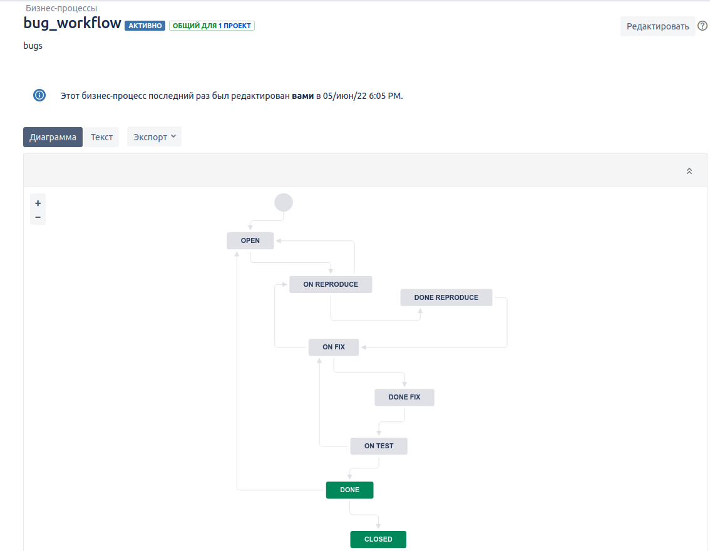
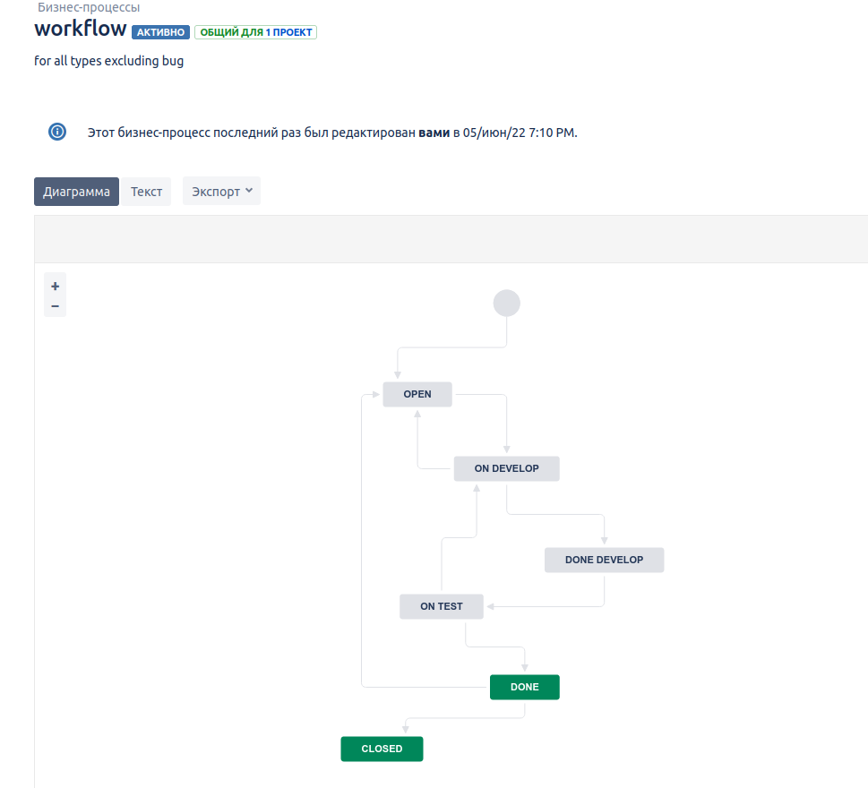
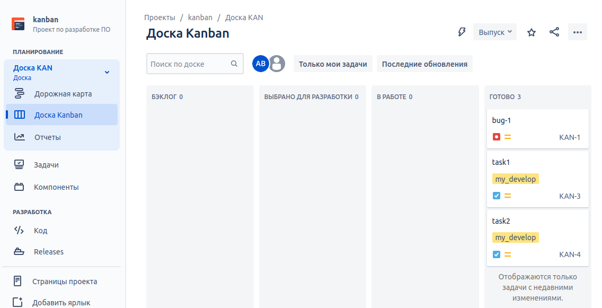
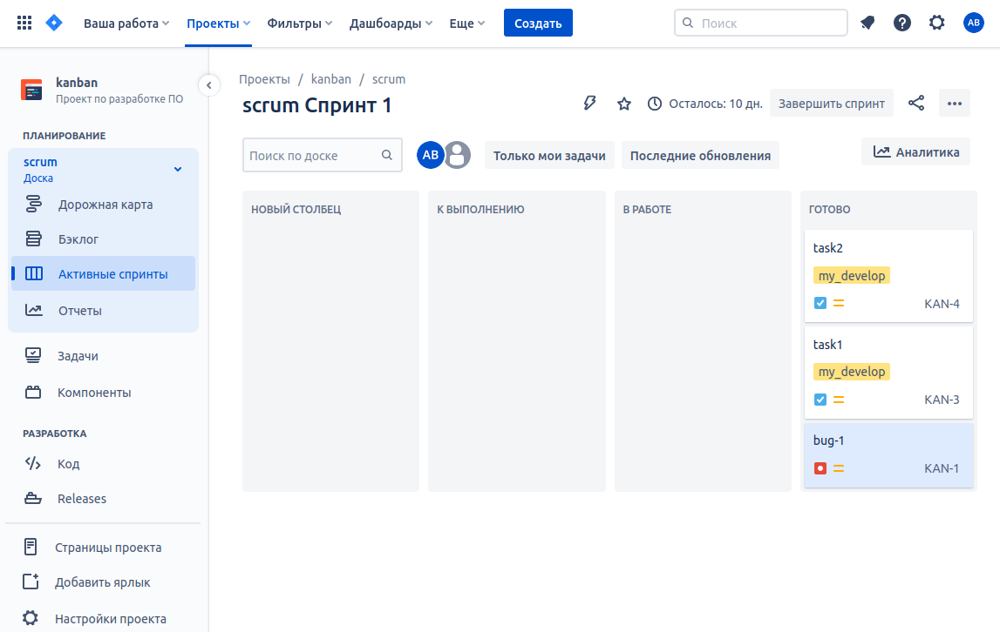
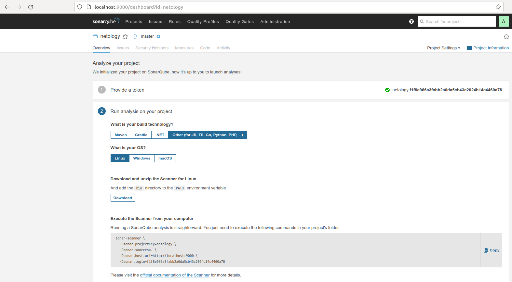
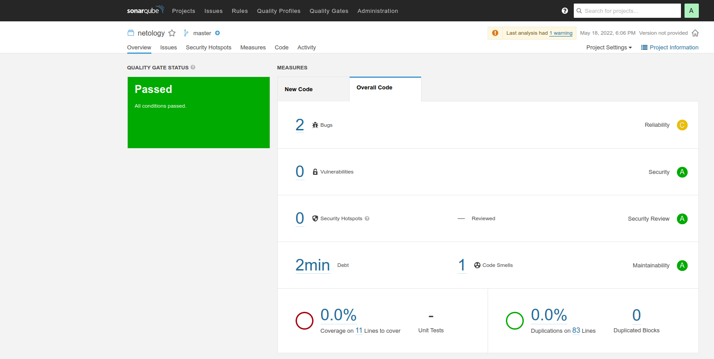
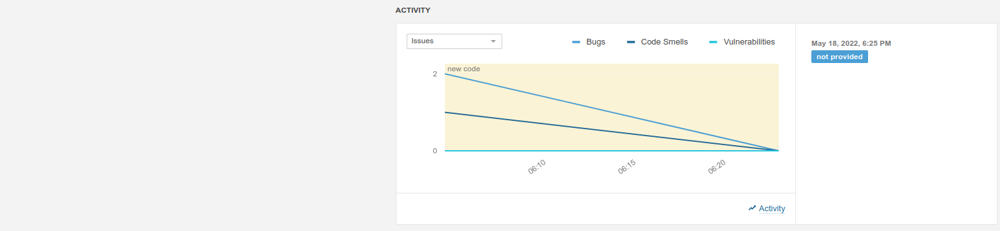

# 09.01 Жизненный цикл ПО
### В рамках основной части необходимо создать собственные workflow для двух типов задач: bug и остальные типы задач.
#### Workflow for bug

#### Workflow для остальных типов задач

### Проведение задач по статусам в kanban

### Проведение задач по статусам в scrum

### Если всё отработало в рамках ожидания - выгрузить схемы workflow для импорта в XML. Файлы с workflow приложить к решению задания.
[bug_wflow.xml](screenshots/bug_wflow.xml)

[rest_wflow.xml](screenshots/rest_wflow.xml)

# 09.02 CI\CD
### Знакомство с SonarQube
Запускаем контейнер из скачанного с докерхаб образа sonarqube:
```bash
user@user-Aspire-F5-573G:~/netology/9.2$ docker run -d --name sonarqube -e SONAR_ES_BOOTSTRAP_CHECKS_DISABLE=true -p 9000:9000 sonarqube:8.7-community
af1deb07a0cba2a6259445641d0b7670070ca16b1bdd0841607d6cefcfba8d31
user@user-Aspire-F5-573G:~/netology/9.2$ docker ps -a
CONTAINER ID   IMAGE                     COMMAND                  CREATED         STATUS         PORTS                                       NAMES
af1deb07a0cb   sonarqube:8.7-community   "bin/run.sh bin/sona…"   2 minutes ago   Up 2 minutes   0.0.0.0:9000->9000/tcp, :::9000->9000/tcp   sonarqube
```
Проверяем готовность сервиса через браузер, входим под admin/admin, меняем пароль, создаем новый проект (netology), получаем токен,
cкачиваем пакет sonar-scanner, который нам предлагает скачать сам sonarqube:

Делаем так, чтобы binary был доступен через вызов в shell (меняем переменную PATH), проверяем:
```bash
user@user-Aspire-F5-573G:~/netology/9.2$ sonar-scanner --version
INFO: Scanner configuration file: /home/user/sonarscan/sonar-scanner-4.7.0.2747-linux/conf/sonar-scanner.properties
INFO: Project root configuration file: NONE
INFO: SonarScanner 4.7.0.2747
INFO: Java 11.0.14.1 Eclipse Adoptium (64-bit)
INFO: Linux 5.4.0-109-generic amd64
```
Скачиваем предлагаемый в задании файл кода в рабочую директорию:
```bash
user@user-Aspire-F5-573G:~/netology/9.2$ wget https://raw.githubusercontent.com/netology-code/mnt-homeworks/master/09-ci-02-cicd/example/fail.py
--2022-05-18 17:22:09--  https://raw.githubusercontent.com/netology-code/mnt-homeworks/master/09-ci-02-cicd/example/fail.py
Распознаётся raw.githubusercontent.com (raw.githubusercontent.com)… 2606:50c0:8001::154, 2606:50c0:8003::154, 2606:50c0:8002::154, ...
Подключение к raw.githubusercontent.com (raw.githubusercontent.com)|2606:50c0:8001::154|:443... ошибка: Сеть недоступна.
Подключение к raw.githubusercontent.com (raw.githubusercontent.com)|2606:50c0:8003::154|:443... ошибка: Сеть недоступна.
Подключение к raw.githubusercontent.com (raw.githubusercontent.com)|2606:50c0:8002::154|:443... ошибка: Сеть недоступна.
Подключение к raw.githubusercontent.com (raw.githubusercontent.com)|2606:50c0:8000::154|:443... ошибка: Сеть недоступна.
Подключение к raw.githubusercontent.com (raw.githubusercontent.com)|185.199.110.133|:443... соединение установлено.
HTTP-запрос отправлен. Ожидание ответа… 200 OK
Длина: 255 [text/plain]
Сохранение в: «fail.py»

fail.py             100%[===================>]     255  --.-KB/s    за 0s      

2022-05-18 17:22:10 (2,71 MB/s) - «fail.py» сохранён [255/255]
```
Запускаем анализатор против скачанного кода с дополнительным ключом -Dsonar.coverage.exclusions=fail.py
```bash
user@user-Aspire-F5-573G:~/netology/9.2$ sonar-scanner \
>   -Dsonar.projectKey=netology \
>   -Dsonar.sources=. \
>   -Dsonar.host.url=http://localhost:9000 \
>   -Dsonar.login=f1f8e966a3fabb2a0da5cb43c2024b14c4460a78\
>   -Dsonar.coverage.exclusions=fail.py
INFO: Scanner configuration file: /home/user/sonarscan/sonar-scanner-4.7.0.2747-linux/conf/sonar-scanner.properties
INFO: Project root configuration file: NONE
INFO: SonarScanner 4.7.0.2747
INFO: Java 11.0.14.1 Eclipse Adoptium (64-bit)
INFO: Linux 5.4.0-109-generic amd64
INFO: User cache: /home/user/.sonar/cache
INFO: Scanner configuration file: /home/user/sonarscan/sonar-scanner-4.7.0.2747-linux/conf/sonar-scanner.properties
INFO: Project root configuration file: NONE
INFO: Analyzing on SonarQube server 8.7.1
INFO: Default locale: "ru_RU", source code encoding: "UTF-8" (analysis is platform dependent)
INFO: Load global settings
INFO: Load global settings (done) | time=216ms
INFO: Server id: BF41A1F2-AYDXlqtv7eTjZ9n7QXfV
INFO: User cache: /home/user/.sonar/cache
INFO: Load/download plugins
INFO: Load plugins index
INFO: Load plugins index (done) | time=150ms
INFO: Load/download plugins (done) | time=827ms
INFO: Process project properties
INFO: Process project properties (done) | time=9ms
INFO: Execute project builders
INFO: Execute project builders (done) | time=2ms
INFO: Project key: netology
INFO: Base dir: /home/user/netology/9.2
INFO: Working dir: /home/user/netology/9.2/.scannerwork
INFO: Load project settings for component key: 'netology'
INFO: Load project settings for component key: 'netology' (done) | time=62ms
INFO: Load quality profiles
INFO: Load quality profiles (done) | time=158ms
INFO: Load active rules
INFO: Load active rules (done) | time=2674ms
WARN: SCM provider autodetection failed. Please use "sonar.scm.provider" to define SCM of your project, or disable the SCM Sensor in the project settings.
INFO: Indexing files...
INFO: Project configuration:
INFO:   Excluded sources for coverage: fail.py
INFO: 7 files indexed
INFO: Quality profile for py: Sonar way
INFO: Quality profile for xml: Sonar way
INFO: ------------- Run sensors on module netology
INFO: Load metrics repository
INFO: Load metrics repository (done) | time=103ms
INFO: Sensor Python Sensor [python]
INFO: Starting global symbols computation
INFO: 2 source files to be analyzed
INFO: Load project repositories
INFO: Load project repositories (done) | time=71ms
INFO: Starting rules execution
INFO: 2 source files to be analyzed
INFO: 2/2 source files have been analyzed
INFO: 2/2 source files have been analyzed
INFO: Sensor Python Sensor [python] (done) | time=5572ms
INFO: Sensor Cobertura Sensor for Python coverage [python]
INFO: Sensor Cobertura Sensor for Python coverage [python] (done) | time=8ms
INFO: Sensor PythonXUnitSensor [python]
INFO: Sensor PythonXUnitSensor [python] (done) | time=1ms
INFO: Sensor CSS Rules [cssfamily]
INFO: No CSS, PHP, HTML or VueJS files are found in the project. CSS analysis is skipped.
INFO: Sensor CSS Rules [cssfamily] (done) | time=0ms
INFO: Sensor JaCoCo XML Report Importer [jacoco]
INFO: 'sonar.coverage.jacoco.xmlReportPaths' is not defined. Using default locations: target/site/jacoco/jacoco.xml,target/site/jacoco-it/jacoco.xml,build/reports/jacoco/test/jacocoTestReport.xml
INFO: No report imported, no coverage information will be imported by JaCoCo XML Report Importer
INFO: Sensor JaCoCo XML Report Importer [jacoco] (done) | time=2ms
INFO: Sensor C# Properties [csharp]
INFO: Sensor C# Properties [csharp] (done) | time=1ms
INFO: Sensor JavaXmlSensor [java]
INFO: 3 source files to be analyzed
INFO: Sensor JavaXmlSensor [java] (done) | time=361ms
INFO: 3/3 source files have been analyzed
INFO: Sensor HTML [web]
INFO: Sensor HTML [web] (done) | time=3ms
INFO: Sensor XML Sensor [xml]
INFO: 3 source files to be analyzed
INFO: Sensor XML Sensor [xml] (done) | time=171ms
INFO: Sensor VB.NET Properties [vbnet]
INFO: 3/3 source files have been analyzed
INFO: Sensor VB.NET Properties [vbnet] (done) | time=1ms
INFO: ------------- Run sensors on project
INFO: Sensor Zero Coverage Sensor
INFO: Sensor Zero Coverage Sensor (done) | time=21ms
INFO: SCM Publisher No SCM system was detected. You can use the 'sonar.scm.provider' property to explicitly specify it.
INFO: CPD Executor Calculating CPD for 2 files
INFO: CPD Executor CPD calculation finished (done) | time=10ms
INFO: Analysis report generated in 82ms, dir size=97 KB
INFO: Analysis report compressed in 41ms, zip size=17 KB
INFO: Analysis report uploaded in 105ms
INFO: ANALYSIS SUCCESSFUL, you can browse http://localhost:9000/dashboard?id=netology
INFO: Note that you will be able to access the updated dashboard once the server has processed the submitted analysis report
INFO: More about the report processing at http://localhost:9000/api/ce/task?id=AYDXtT-z7eTjZ9n7Qceh
INFO: Analysis total time: 12.703 s
INFO: ------------------------------------------------------------------------
INFO: EXECUTION SUCCESS
INFO: ------------------------------------------------------------------------
INFO: Total time: 17.604s
INFO: Final Memory: 7M/30M
INFO: ------------------------------------------------------------------------
```
Смотрим результат в интерфейсе

Исправляем файл
```TEXT
def increment(index):
    index_new = index + 1
    return index_new
def get_square(numb):
    return numb*numb
def print_numb(numb):
    print("Number is {}".format(numb))

index = 0
while (index < 10):
    index = increment(index)
    print(get_square(index))
```
Ещё раз запускаем анализатор и смотрим результат в интерфейсе:



### Знакомство с Nexus
[maven-metadata.xml](screenshots/maven-metadata.xml)
### Знакомство с Maven
[pom.xml](screenshots/pom.xml)
