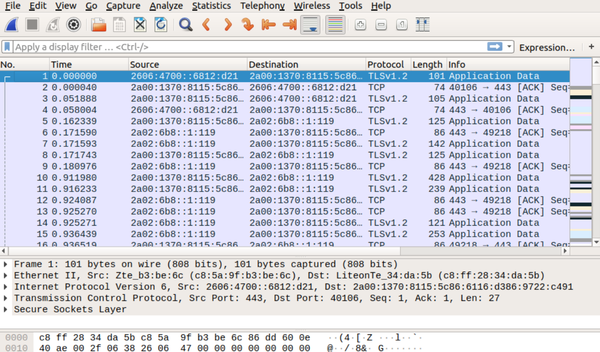

# 3.2. Работа в терминале, лекция 2
### 1. Какого типа команда cd? Попробуйте объяснить, почему она именно такого типа; опишите ход своих мыслей, если считаете что она могла бы быть другого типа.
`cd` - встроенная команда оболочки.
```bash
vagrant@vagrant:~$ type cd
cd is a shell builtin
```
Если бы она была другого типа (отдельной программой), то рабочий каталог менялся бы только в ее окружениии, и другие программы, запущенные от этого же родительского процесса, не видели бы изменений
### 2. Какая альтернатива без pipe команде grep <some_string> <some_file> | wc -l? man grep поможет в ответе на этот вопрос. Ознакомьтесь с документом о других подобных некорректных вариантах использования pipe.
`grep <some_string> <some_file> -c`
### 3. Какой процесс с PID 1 является родителем для всех процессов в вашей виртуальной машине Ubuntu 20.04?
Процесс `systemd`
### 4. Как будет выглядеть команда, которая перенаправит вывод stderr ls на другую сессию терминала?
`ls /fff 2>/dev/pts/1`
### 5. Получится ли одновременно передать команде файл на stdin и вывести ее stdout в другой файл? Приведите работающий пример.
`cat < file1 > file2`
### 6. Получится ли находясь в графическом режиме, вывести данные из PTY в какой-либо из эмуляторов TTY? Сможете ли вы наблюдать выводимые данные?
Нужно перенаправить вывод:
`echo hello > /dev/tty2`
Для просмотра нужно перейти, в нашем случае, в терминал tty2.
### 7. Выполните команду bash 5>&1. К чему она приведет? Что будет, если вы выполните echo netology > /proc/$$/fd/5? Почему так происходит?
Первая команда создаст новый дескриптор `5` для данной сессии и перенаправит его в `stdout`.
Вторая команда запишет строку `netology` в этот дескриптор, который перенаправит её в `stdout`.
### 8. Получится ли в качестве входного потока для pipe использовать только stderr команды, не потеряв при этом отображение stdout на pty? Напоминаем: по умолчанию через pipe передается только stdout команды слева от | на stdin команды справа. Это можно сделать, поменяв стандартные потоки местами через промежуточный новый дескриптор, который вы научились создавать в предыдущем вопросе.
Получится, например, с такой командой: `ls <some folder> 5>&1 1>&2 2>&5| grep <some string>`.
### 9. Что выведет команда cat /proc/$$/environ? Как еще можно получить аналогичный по содержанию вывод?
Команда `cat /proc/$$/environ` выводит переменные окружения. Аналогичный по содержанию вывод можно получить с помощью команды `env`.
### 10. Используя man, опишите что доступно по адресам `/proc/<PID>/cmdline`, `/proc/<PID>/exe`.
`/proc/[pid]/cmdline` - файл только для чтения, содержащий полную строку команды для процесса.
`/proc/[pid]/exe` - данный файл является символической ссылкой, содержащей актуальный путь исполняемой команды.
### 11. Узнайте, какую наиболее старшую версию набора инструкций SSE поддерживает ваш процессор с помощью /proc/cpuinfo.
`sse4_2`
Ответ получен с помощью команды `cat /proc/cpuinfo | grep sse`.
### 12. При открытии нового окна терминала и vagrant ssh создается новая сессия и выделяется pty. Это можно подтвердить командой tty, которая упоминалась в лекции 3.2. Однако:
```sh
vagrant@netology1:~$ ssh localhost 'tty'
not a tty
```
###    Почитайте, почему так происходит, и как изменить поведение.
Это происходит из-за того что при попытке выполнить команду `tty` удаленно через `SSH` `tty` не выделяется. Для принудительного выделения `tty` необходимо использовать ключ `-t`. В таком случае псевдотерминал 
выделится принудительно, даже если у текущего `SSH` его нет.
### 13. Бывает, что есть необходимость переместить запущенный процесс из одной сессии в другую. Попробуйте сделать это, воспользовавшись reptyr. Например, так можно перенести в screen процесс, который вы запустили по ошибке в обычной SSH-сессии.
Сделано.
### 14. sudo echo string > /root/new_file не даст выполнить перенаправление под обычным пользователем, так как перенаправлением занимается процесс shell'а, который запущен без sudo под вашим пользователем. Для решения данной проблемы можно использовать конструкцию echo string | sudo tee /root/new_file. Узнайте что делает команда tee и почему в отличие от sudo echo команда с sudo tee будет работать.
Команда `tee` читает из `STDIN` и записывает в `STDOUT` или в файл. В данном случае перенаправление в файл /root/new_file осуществляется в момент исполнения команды с sudo и поэтому проходит успешно. 

# 3.3. Операционные системы, лекция 1
### 1. Какой системный вызов делает команда cd? В прошлом ДЗ мы выяснили, что cd не является самостоятельной программой, это shell builtin, поэтому запустить strace непосредственно на cd не получится. Тем не менее, вы можете запустить strace на /bin/bash -c 'cd /tmp'. В этом случае вы увидите полный список системных вызовов, которые делает сам bash при старте. Вам нужно найти тот единственный, который относится именно к cd. Обратите внимание, что strace выдаёт результат своей работы в поток stderr, а не в stdout.
Системный вызов - `chdir("/tmp")`
### 2. Попробуйте использовать команду file на объекты разных типов на файловой системе. Например... Используя strace выясните, где находится база данных file на основании которой она делает свои догадки.
База данных - `/usr/share/misc/magic.mgc`. Кроме того, поиск осуществляется в: `~/.magic.mgc`, `~/.magic`, `/etc/magic.mgc`, `/etc/magic`. 
### 3. Предположим, приложение пишет лог в текстовый файл. Этот файл оказался удален (deleted в lsof), однако возможности сигналом сказать приложению переоткрыть файлы или просто перезапустить приложение – нет. Так как приложение продолжает писать в удаленный файл, место на диске постепенно заканчивается. Основываясь на знаниях о перенаправлении потоков предложите способ обнуления открытого удаленного файла (чтобы освободить место на файловой системе).
1. По `pid` находим дескриптор файла `<fd>`.
2. Записываем в файл пустое значение с удалением содержимого: `echo '' > /proc/<pid>/fd/<fd>`.
### 4. Занимают ли зомби-процессы какие-то ресурсы в ОС (CPU, RAM, IO)?
Зомби-процессы не занимают ресурсы (освобождают их), при этом остается запись в таблице процессов.
### 5. В iovisor BCC есть утилита opensnoop: ... На какие файлы вы увидели вызовы группы open за первую секунду работы утилиты? Воспользуйтесь пакетом bpfcc-tools для Ubuntu 20.04.
``` bash
root@vagrant:~# dpkg -L bpfcc-tools | grep sbin/opensnoop
/usr/sbin/opensnoop-bpfcc
root@vagrant:~# /usr/sbin/opensnoop-bpfcc
PID    COMM               FD ERR PATH
769    vminfo              4   0 /var/run/utmp
579    dbus-daemon        -1   2 /usr/local/share/dbus-1/system-services
579    dbus-daemon        17   0 /usr/share/dbus-1/system-services
579    dbus-daemon        -1   2 /lib/dbus-1/system-services
579    dbus-daemon        17   0 /var/lib/snapd/dbus-1/system-services/
```
### 6. Какой системный вызов использует uname -a? Приведите цитату из man по этому системному вызову, где описывается альтернативное местоположение в /proc, где можно узнать версию ядра и релиз ОС.
Cистемный вызов - `uname()`. 
`man`:
```TEXT
Part of the utsname information is also accessible  via  /proc/sys/kernel/{ostype, hostname, osrelease, version, domainname}.
```
### 7. Чем отличается последовательность команд через ; и через && в bash? Например:... Есть ли смысл использовать в bash &&, если применить set -e?
`;` - разделитель команд, вторая команда запустится независимо от статуса завершения первой. `&&` - тоже разделитель, но в этом случае вторая команда не запустится, если первая завершится с ошибкой.
Если применить `set -e`, то произойдет выход из сценария при ненулевом коде возврата команды, однако если с ошибкой завершится одна из команд, разделённых &&, кроме последней, то выхода из сценария не произойдёт. 
### 8. Из каких опций состоит режим bash set -euxo pipefail и почему его хорошо было бы использовать в сценариях?
```TEXT
  -e - сценарий завершится если команда завершится с ненулевым статусом
  -u - сценарий завершится, при попытке использовать незаданную переменную
  -x - выведет команды и их аргументы по мере выполнения
  -o pipefail - вернет статус последней команды с ошибкой в пайплайне
```
Это хорошо использовать в сценариях т.к.: `-x` подробно покажет работу сценария, `-u` завершит сценарий при попытке использовать незаданную переменную, а `-e` совместно с `pipefail` покажут на какой команде произошла ошибка сценария.

### 9. Используя -o stat для ps, определите, какой наиболее часто встречающийся статус у процессов в системе. В man ps ознакомьтесь (/PROCESS STATE CODES) что значат дополнительные к основной заглавной буквы статуса процессов. Его можно не учитывать при расчете (считать S, Ss или Ssl равнозначными).
Наиболее часто встречающийся статус - `S`: прерываемый сон (ожидает события для завершени), а также - `I`: неактивный процесс ядра. Дополнительные (к основной) буквы статуса процесса: < - процесс с высоким приоритетом, N - процесс с низким приоритетом, s - процесс инициировавший сессию. 

# 3.4. Операционные системы, лекция 2
### 1. На лекции мы познакомились с node_exporter. В демонстрации его исполняемый файл запускался в background. Этого достаточно для демо, но не для настоящей production-системы, где процессы должны находиться под внешним управлением. Используя знания из лекции по systemd, создайте самостоятельно простой unit-файл для node_exporter.

Unit-файл /etc/systemd/system/nex.service:
```TEXT
[Unit]
Description=node_exporter

[Service]
EnvironmentFile=/opt/node_exporter-1.3.0.linux-amd64/nex.env
ExecStart=/opt/node_exporter-1.3.0.linux-amd64/node_exporter $EXTRA_OPTS

[Install]
WantedBy=multi-user.target
```
Файл для добавления опций /opt/node_exporter-1.3.0.linux-amd64/nex_env:
```TEXT
EXTRA_OPTS="--log.level=info"
```
Запущены команды:
```TEXT
systemctl daemon-reload -применение настроек
systemctl enable nodex - добавление в автозагрузку
systemctl start nodex - запуск
systemctl status nodex - просмотр статуса
systemctl stop nodex - остановка
```
Проверено, что с помощью systemctl процесс корректно стартует, завершается, а после перезагрузки автоматически поднимается.

### 2. Ознакомьтесь с опциями node_exporter и выводом /metrics по-умолчанию. Приведите несколько опций, которые вы бы выбрали для базового мониторинга хоста по CPU, памяти, диску и сети.
CPU:
```TEXT
node_cpu_seconds_total{cpu="0",mode="iowait"} 135.71
node_cpu_seconds_total{cpu="0",mode="system"} 49.81
node_cpu_seconds_total{cpu="0",mode="user"} 24.84
node_cpu_seconds_total{cpu="1",mode="iowait"} 141.63
node_cpu_seconds_total{cpu="1",mode="system"} 63.78
node_cpu_seconds_total{cpu="1",mode="user"} 26.47
```
Память:
```TEXT
node_memory_MemAvailable_bytes 7.1888896e+08
node_memory_MemFree_bytes 1.92479232e+08
node_memory_MemTotal_bytes 1.028694016e+09
node_memory_SwapFree_bytes 1.027600384e+09
```
Диск:
```TEXT
node_disk_io_now{device="sda"} 0
node_disk_io_time_seconds_total{device="sda"} 262.75600000000003
node_disk_io_time_weighted_seconds_total{device="sda"} 1083.036
node_disk_read_bytes_total{device="sda"} 3.45965568e+08
```
Сеть:
```TEXT
node_network_receive_bytes_total{device="eth0"} 4.2784829e+07
node_network_receive_drop_total{device="eth0"} 0
node_network_transmit_bytes_total{device="eth0"} 1.592844e+06
node_network_transmit_drop_total{device="eth0"} 0
```
### 3. Установите в свою виртуальную машину Netdata. Воспользуйтесь готовыми пакетами для установки (sudo apt install -y netdata). 
Netdata установлена, в файлы внесены изменения, порт проброшен, vagrant перезагружен. С метриками ознакомился.

### 4. Можно ли по выводу dmesg понять, осознает ли ОС, что загружена не на настоящем оборудовании, а на системе виртуализации?
Да, можно. Вывод `dmesg`:
```bash
[    0.000000] DMI: innotek GmbH VirtualBox/VirtualBox, BIOS VirtualBox 12/01/2006
[    0.000000] Hypervisor detected: KVM
```
### 5. Как настроен sysctl fs.nr_open на системе по-умолчанию? Узнайте, что означает этот параметр. Какой другой существующий лимит не позволит достичь такого числа (ulimit --help)?
Для получения `fs.nr_open` нужно запустить команду: `sysctl -n fs.nr_open`. Значение показывает максимальное количество открытых файлов на процесс,
по умолчанию - 1048576. Это значение не позволит достичь другой лимит: `open files` из вывода команды: `ulimit -a`, значение по умолчанию у
которого - 1024.

### 6. Запустите любой долгоживущий процесс (не ls, который отработает мгновенно, а, например, sleep 1h) в отдельном неймспейсе процессов; покажите, что ваш процесс работает под PID 1 через nsenter.
```bash
root@vagrant:~# ps -e | grep sleep
   1550 pts/0    00:00:00 sleep
root@vagrant:~# nsenter --target 1550 --pid --mount
root@vagrant:/# ps
    PID TTY          TIME CMD
      1 pts/0    00:00:00 sleep
      2 pts/0    00:00:00 bash
```
### 7. Найдите информацию о том, что такое :(){ :|:& };:. Запустите эту команду в своей виртуальной машине Vagrant с Ubuntu 20.04 (это важно, поведение в других ОС не проверялось). Некоторое время все будет "плохо", после чего (минуты) – ОС должна стабилизироваться. Вызов dmesg расскажет, какой механизм помог автоматической стабилизации. Как настроен этот механизм по-умолчанию, и как изменить число процессов, которое можно создать в сессии?
:(){ :|:& };: - форкбомба. 
Это функция, которая рекурсивно запускает саму себя и результат отправляет через пайп себе на вход для запуска в бэкграунде. Данный процесс упирается в ограничение `ulimit -u` (количество процессов на пользователя).
Сообщение в `dmesg`:
```bash
[ 1934.590198] cgroup: fork rejected by pids controller in /user.slice/user-1000.slice/session-3.scope
```
Количество процессов на пользователя можно поменять командой  `ulimit -u N`, `N`  - новое значение.

# 3.5. Файловые системы
### 1. Узнайте о sparse (разряженных) файлах.
Сделано
### 2. Могут ли файлы, являющиеся жесткой ссылкой на один объект, иметь разные права доступа и владельца? Почему?
Нет, т.к. жесткие ссылки ссылаются на один inode, у которого имеются права доступа и владелец.
### 3. Сделайте vagrant destroy на имеющийся инстанс Ubuntu. Замените содержимое Vagrantfile следующим:... Данная конфигурация создаст новую виртуальную машину с двумя дополнительными неразмеченными дисками по 2.5 Гб.
Добавлены диски `sdb`, `sdc`.
```bash
sdb                    8:16   0  2.5G  0 disk 
sdc                    8:32   0  2.5G  0 disk 
```
### 4. Используя fdisk, разбейте первый диск на 2 раздела: 2 Гб, оставшееся пространство.
Сделано
```bash
root@vagrant:~# fdisk -l /dev/sdb
Disk /dev/sdb: 2.51 GiB, 2684354560 bytes, 5242880 sectors
Disk model: VBOX HARDDISK
Units: sectors of 1 * 512 = 512 bytes
Sector size (logical/physical): 512 bytes / 512 bytes
I/O size (minimum/optimal): 512 bytes / 512 bytes
Disklabel type: dos
Disk identifier: 0xf9b6efb5

Device     Boot   Start     End Sectors  Size Id Type
/dev/sdb1          2048 4196351 4194304    2G 83 Linux
/dev/sdb2       4196352 5242879 1046528  511M 83 Linux
```
### 5. Используя sfdisk, перенесите данную таблицу разделов на второй диск.
```bash
root@vagrant:~# sfdisk -d /dev/sdb > partitions
root@vagrant:~# sfdisk /dev/sdc < partitions
...
Device     Boot   Start     End Sectors  Size Id Type
/dev/sdc1          2048 4196351 4194304    2G 83 Linux
/dev/sdc2       4196352 5242879 1046528  511M 83 Linux
```
### 6. Соберите mdadm RAID1 на паре разделов 2 Гб.
```bash
root@vagrant:~# mdadm --create /dev/md0 --level=1 --raid-devices=2 /dev/sdb1 /dev/sdc1
```
### 7. Соберите mdadm RAID0 на второй паре маленьких разделов.
```bash
root@vagrant:~# mdadm --create /dev/md1 --level=0 --raid-devices=2 /dev/sdb2 /dev/sdc2
```
### 8. Создайте 2 независимых PV на получившихся md-устройствах.
```bash
root@vagrant:~# pvcreate /dev/md1 /dev/md0
  Physical volume "/dev/md1" successfully created.
  Physical volume "/dev/md0" successfully created.
```
### 9. Создайте общую volume-group на этих двух PV
```bash
root@vagrant:~# vgcreate vol_grp1 /dev/md1 /dev/md0
  Volume group "vol_grp1" successfully created
root@vagrant:~# vgs
  VG        #PV #LV #SN Attr   VSize   VFree 
  vgvagrant   1   2   0 wz--n- <63.50g     0 
  vol_grp1    2   0   0 wz--n-  <2.99g <2.99g
```
### 10. Создайте LV размером 100 Мб, указав его расположение на PV с RAID0.
```bash
root@vagrant:~# lvcreate -L 100M -n log_vol0 vol_grp1 /dev/md1
  Logical volume "log_vol0" created.
root@vagrant:~# lvs
  LV       VG        Attr       LSize   Pool Origin Data%  Meta%  Move Log Cpy%Sync Convert
  root     vgvagrant -wi-ao---- <62.54g
  swap_1   vgvagrant -wi-ao---- 980.00m
  log_vol0 vol_grp1  -wi-a----- 100.00m
```
### 11. Создайте mkfs.ext4 ФС на получившемся LV.
```bash
root@vagrant:~# mkfs.ext4 /dev/vol_grp1/log_vol0
mke2fs 1.45.5 (07-Jan-2020)
Creating filesystem with 25600 4k blocks and 25600 inodes

Allocating group tables: done                            
Writing inode tables: done                            
Creating journal (1024 blocks): done
Writing superblocks and filesystem accounting information: done
```
### 12. Смонтируйте этот раздел в любую директорию, например, /tmp/new.
```bash
root@vagrant:~# mkdir /tmp/new
root@vagrant:~# mount /dev/vol_grp1/log_vol0 /tmp/new
```
### 13. Поместите туда тестовый файл, например wget https://mirror.yandex.ru/ubuntu/ls-lR.gz -O /tmp/new/test.gz
```bash
root@vagrant:~# wget https://mirror.yandex.ru/ubuntu/ls-lR.gz -O /tmp/new/test.gz
root@vagrant:~# ls -l /tmp/new
total 22064
drwx------ 2 root root    16384 Nov 30 22:49 lost+found
-rw-r--r-- 1 root root 22574425 Nov 29 09:55 test.gz
```
### 14. Прикрепите вывод lsblk.
```bash
root@vagrant:~# lsblk
NAME                    MAJ:MIN RM  SIZE RO TYPE  MOUNTPOINT
sda                       8:0    0   64G  0 disk
├─sda1                    8:1    0  512M  0 part  /boot/efi
├─sda2                    8:2    0    1K  0 part
└─sda5                    8:5    0 63.5G  0 part
  ├─vgvagrant-root      253:0    0 62.6G  0 lvm   /
  └─vgvagrant-swap_1    253:1    0  980M  0 lvm   [SWAP]
sdb                       8:16   0  2.5G  0 disk
├─sdb1                    8:17   0    2G  0 part
│ └─md0                   9:0    0    2G  0 raid1
└─sdb2                    8:18   0  511M  0 part
  └─md1                   9:1    0 1018M  0 raid0
    └─vol_grp1-log_vol0 253:2    0  100M  0 lvm   /tmp/new
sdc                       8:32   0  2.5G  0 disk
├─sdc1                    8:33   0    2G  0 part
│ └─md0                   9:0    0    2G  0 raid1
└─sdc2                    8:34   0  511M  0 part
  └─md1                   9:1    0 1018M  0 raid0
    └─vol_grp1-log_vol0 253:2    0  100M  0 lvm   /tmp/new
```
### 15. Протестируйте целостность файла:
```bash
root@vagrant:~# gzip -t /tmp/new/test.gz
root@vagrant:~# echo $?
0
```
### 16. Используя pvmove, переместите содержимое PV с RAID0 на RAID1.
```bash
root@vagrant:~# pvmove /dev/md1 /dev/md0
  /dev/md1: Moved: 12.00%
  /dev/md1: Moved: 100.00%
```
### 17. Сделайте --fail на устройство в вашем RAID1 md.
```bash
root@vagrant:~# mdadm /dev/md0 --fail /dev/sdc1
mdadm: set /dev/sdc1 faulty in /dev/md0
```
### 18. Подтвердите выводом dmesg, что RAID1 работает в деградированном состоянии.
```bash
root@vagrant:~# dmesg | grep md0 
...
[ 3335.862185] md/raid1:md0: Disk failure on sdc1, disabling device.
               md/raid1:md0: Operation continuing on 1 devices.
```
### 19. Протестируйте целостность файла, несмотря на "сбойный" диск он должен продолжать быть доступен:
```bash
root@vagrant:~# gzip -t /tmp/new/test.gz
root@vagrant:~# echo $?
0
```
### 20. Погасите тестовый хост, vagrant destroy.
Сделано

# 3.6. Компьютерные сети, лекция 1
### 1. Работа c HTTP через телнет.
```bash
$ telnet stackoverflow.com 80
Trying 151.101.193.69...
Connected to stackoverflow.com.
Escape character is '^]'.
GET /questions HTTP/1.0
HOST: stackoverflow.com

HTTP/1.1 301 Moved Permanently
cache-control: no-cache, no-store, must-revalidate
location: https://stackoverflow.com/questions
x-request-guid: 50b6df3a-0d10-4972-b7b1-394b436de8b5
feature-policy: microphone 'none'; speaker 'none'
content-security-policy: upgrade-insecure-requests; frame-ancestors 'self' https://stackexchange.com
Accept-Ranges: bytes
Date: Wed, 01 Dec 2021 14:21:18 GMT
Via: 1.1 varnish
Connection: close
X-Served-By: cache-fra19156-FRA
X-Cache: MISS
X-Cache-Hits: 0
X-Timer: S1638368479.788046,VS0,VE92
Vary: Fastly-SSL
X-DNS-Prefetch-Control: off
Set-Cookie: prov=06800ab5-e816-4391-2a53-c1e68dcaac3d; domain=.stackoverflow.com; expires=Fri, 01-Jan-2055 00:00:00 GMT; path=/; HttpOnly

Connection closed by foreign host.
```
Полученный HTTP код - `301`, означает, что запрошенный ресурс был на постоянной основе перемещён в новое месторасположение (location: https://stackoverflow.com/questions).
### 2. Повторите задание 1 в браузере, используя консоль разработчика F12
[img1](https://c.radikal.ru/c00/2112/09/e081f1d3cd1a.png)
[img2](https://b.radikal.ru/b11/2112/15/53817b6134a3.png)
Код первого ответа HTTP сервера - 307 - временное перенаправление. Время загрузки страницы - 3.43 с. Дольше всего обрабатывался запрос https://stackoverflow.com - 532 мс. 
### 3. Какой IP адрес у вас в интернете?
188.255.xx.xx, результат запроса https://whoer.net/.
### 4. Какому провайдеру принадлежит ваш IP адрес? Какой автономной системе AS? Воспользуйтесь утилитой whois
```bash
$ whois 188.255.xx.xx | grep descr
descr:          Rostelecom
...
$ whois 188.255.xx.xx | grep origin
origin:         AS42610
```
### 5. Через какие сети проходит пакет, отправленный с вашего компьютера на адрес 8.8.8.8? Через какие AS? Воспользуйтесь утилитой traceroute
```bash
$ traceroute -An 8.8.8.8
traceroute to 8.8.8.8 (8.8.8.8), 30 hops max, 60 byte packets
 9  108.170.250.34 [AS15169]  7.895 ms  7.700 ms 108.170.250.99 [AS15169]  7.524 ms
10  209.85.249.158 [AS15169]  22.871 ms 209.85.255.136 [AS15169]  26.212 ms  26.408 ms
11  209.85.254.20 [AS15169]  26.245 ms 216.239.57.222 [AS15169]  22.243 ms 108.170.235.64 [AS15169]  27.519 ms
12  172.253.51.237 [AS15169]  27.383 ms 74.125.253.147 [AS15169]  35.288 ms 216.239.47.165 [AS15169]  73.430 ms
```
```bash
$ whois AS15169 | grep OrgName
OrgName:        Google LLC
```
Пакет проходит через AS: AS15169, принадлежит Google LLC.
### 6. Повторите задание 5 в утилите mtr. На каком участке наибольшая задержка - delay?
```bash
$ mtr 8.8.8.8 -znrc 1
Start: 2021-12-01T15:47:14+0000
HOST: vagrant                     Loss%   Snt   Last   Avg  Best  Wrst StDev
  1. AS???    10.0.2.2             0.0%     1    0.8   0.8   0.8   0.8   0.0
  2. AS???    192.168.199.1        0.0%     1    4.0   4.0   4.0   4.0   0.0
  3. AS???    ???                 100.0     1    0.0   0.0   0.0   0.0   0.0
  4. AS???    ???                 100.0     1    0.0   0.0   0.0   0.0   0.0
  5. AS15169  72.14.209.81         0.0%     1    5.3   5.3   5.3   5.3   0.0
  6. AS15169  108.170.250.33       0.0%     1    6.9   6.9   6.9   6.9   0.0
  7. AS15169  108.170.250.34       0.0%     1    8.1   8.1   8.1   8.1   0.0
  8. AS15169  172.253.66.116       0.0%     1   22.5  22.5  22.5  22.5   0.0
  9. AS15169  209.85.254.6         0.0%     1   27.1  27.1  27.1  27.1   0.0
 10. AS15169  172.253.51.241       0.0%     1   24.7  24.7  24.7  24.7   0.0
 11. AS???    ???                 100.0     1    0.0   0.0   0.0   0.0   0.0
 12. AS???    ???                 100.0     1    0.0   0.0   0.0   0.0   0.0
 13. AS???    ???                 100.0     1    0.0   0.0   0.0   0.0   0.0
 14. AS???    ???                 100.0     1    0.0   0.0   0.0   0.0   0.0
 15. AS???    ???                 100.0     1    0.0   0.0   0.0   0.0   0.0
 16. AS???    ???                 100.0     1    0.0   0.0   0.0   0.0   0.0
 17. AS???    ???                 100.0     1    0.0   0.0   0.0   0.0   0.0
 18. AS???    ???                 100.0     1    0.0   0.0   0.0   0.0   0.0
 19. AS???    ???                 100.0     1    0.0   0.0   0.0   0.0   0.0
 20. AS???    ???                 100.0     1    0.0   0.0   0.0   0.0   0.0
 21. AS15169  8.8.8.8              0.0%     1   21.6  21.6  21.6  21.6   0.0
```
Максимальная задержка на участке 9. 
### 7. Какие DNS сервера отвечают за доменное имя dns.google? Какие A записи? воспользуйтесь утилитой dig
```bash
vagrant@vagrant:~$ dig NS dns.google +short
ns3.zdns.google.
ns1.zdns.google.
ns2.zdns.google.
ns4.zdns.google.
vagrant@vagrant:~$ dig A dns.google +short 
8.8.4.4
8.8.8.8
```
### 8. Проверьте PTR записи для IP адресов из задания 7. Какое доменное имя привязано к IP? воспользуйтесь утилитой dig
```bash
vagrant@vagrant:~$ dig -x 8.8.8.8 +short
dns.google.
vagrant@vagrant:~$ dig -x 8.8.4.4 +short
dns.google.
```

# 3.7. Компьютерные сети, лекция 2
### 1. Проверьте список доступных сетевых интерфейсов на вашем компьютере. Какие команды есть для этого в Linux и в Windows?
Linux: `ifconfig -a`, `ip l`; Windows: `ipconfig /all`
### 2. Какой протокол используется для распознавания соседа по сетевому интерфейсу? Какой пакет и команды есть в Linux для этого?
Протокол `LLDP`, пакет `lldpd`.
Команды:
```bash
lldpcli show neighbors - соседи
lldpcli show interfaces - локальные интерфейсы
lldpcli show statistics - статистика: количество переданных, полученных, отклоненных кадров 
```
### 3. Какая технология используется для разделения L2 коммутатора на несколько виртуальных сетей? Какой пакет и команды есть в Linux для этого? Приведите пример конфига.
Технология - VLAN, пакет в Linux Ubuntu - `vlan`. Пример конфига (/etc/network/interfaces):
```bash
auto eth0.10
iface eth0.10 inet static
        address 192.168.199.245
        netmask 255.255.255.0
        vlan-raw-device eth0
```
### 4. Какие типы агрегации интерфейсов есть в Linux? Какие опции есть для балансировки нагрузки? Приведите пример конфига.
Типы агрегации интерфейсов в Linux:
```bash
$ modinfo bonding | grep mode
... 0 for balance-rr, 1 for active-backup, 2 for balance-xor, 3 for broadcast, 4 for 802.3ad, 5 for balance-tlb, 6 for balance-alb
```
```Text
active-backup и broadcast обеспечивают только отказоустойчивость
balance-tlb, balance-alb, balance-rr, balance-xor и 802.3ad обеспечат отказоустойчивость и балансировку
```
Пример конфига:
```yaml 
    bonds: 
      bond0:
        dhcp4: no
        interfaces: [eth0, eth1]
        parameters:
          mode: 802.3ad
          mii-monitor-interval: 1
```
### 5. Сколько IP адресов в сети с маской /29 ? Сколько /29 подсетей можно получить из сети с маской /24. Приведите несколько примеров /29 подсетей внутри сети 10.10.10.0/24.
В сети с маской /29 - 8 адресов. Для хостов можно использовать 6 (за исключением широковещательного адреса и адреса сети).

Сеть с маской /24 разбивается на 32 подсети с маской /29. Примеры:
```bash
Network			- 10.10.10.32     - 10.10.10.39
Network			- 10.10.10.40     - 10.10.10.47
Network			- 10.10.10.48     - 10.10.10.55
Network			- 10.10.10.56     - 10.10.10.63
```
### 6. Задача: вас попросили организовать стык между 2-мя организациями. Диапазоны 10.0.0.0/8, 172.16.0.0/12, 192.168.0.0/16 уже заняты. Из какой подсети допустимо взять частные IP адреса? Маску выберите из расчета максимум 40-50 хостов внутри подсети.
Адреса можно взять из сети Carrier-Grade NAT: `100.64.0.0/10`. Маску можно взять `/26`. Подсеть с такой маской расчитана на 62 хоста.  
### 7. Как проверить ARP таблицу в Linux, Windows? Как очистить ARP кеш полностью? Как из ARP таблицы удалить только один нужный IP?
Проверка ARP таблицы в Linux: `ip neigh show`, `ip n`.
Очистка ARP кеша полностью в Linux: `ip neigh flush`.
Удаление из ARP таблицы только одного нужного IP в Linux: `ip neigh del dev <INTERFACE> <IP>`.

# 3.8. Компьютерные сети, лекция 3
### 1. Подключитесь к публичному маршрутизатору в интернет. Найдите маршрут к вашему публичному IP: ...
```bash
route-views>show ip route 188.255.хх.хх
Routing entry for 188.255.0.0/17
  Known via "bgp 6447", distance 20, metric 0
  Tag 852, type external
  Last update from 154.11.12.212 1w2d ago
  Routing Descriptor Blocks:
  * 154.11.12.212, from 154.11.12.212, 1w2d ago
      Route metric is 0, traffic share count is 1
      AS Hops 3
      Route tag 852
      MPLS label: none
route-views>show bgp 188.255.хх.хх
BGP routing table entry for 188.255.0.0/17, version 1388581119
Paths: (23 available, best #14, table default)
  Not advertised to any peer
  Refresh Epoch 1
  2497 12389 42610
    202.232.0.2 from 202.232.0.2 (58.138.96.254)
      Origin IGP, localpref 100, valid, external
      path 7FE14AE95630 RPKI State not found
      rx pathid: 0, tx pathid: 0
  Refresh Epoch 1
  20912 3257 1299 42610
    212.66.96.126 from 212.66.96.126 (212.66.96.126)
      Origin incomplete, localpref 100, valid, external
      Community: 3257:8101 3257:30055 3257:50001 3257:53900 3257:53902 20912:65004
      path 7FE0B48CF450 RPKI State not found
      rx pathid: 0, tx pathid: 0
  Refresh Epoch 1
  4901 6079 1299 42610
    162.250.137.254 from 162.250.137.254 (162.250.137.254)
      Origin incomplete, localpref 100, valid, external
      Community: 65000:10100 65000:10300 65000:10400
      path 7FE0BDA16080 RPKI State not found
      rx pathid: 0, tx pathid: 0
```
### 2. Создайте dummy0 интерфейс в Ubuntu. Добавьте несколько статических маршрутов. Проверьте таблицу маршрутизации.
Создание dummy0 интерфейса:
```bash
vagrant@vagrant:~$ sudo ip link add dummy0 type dummy
vagrant@vagrant:~$ ip -br l
lo               UNKNOWN        00:00:00:00:00:00 <LOOPBACK,UP,LOWER_UP>
eth0             UP             08:00:27:73:60:cf <BROADCAST,MULTICAST,UP,LOWER_UP>
dummy0           DOWN           aa:cb:d8:1d:24:90 <BROADCAST,NOARP>
```
Добавление статических маршрутов:
```bash
# Добавление маршрута через шлюз: 
vagrant@vagrant:~$ sudo ip route add 192.168.10.0/24 via 10.0.2.15
# Добавление маршрута через интерфейс: 
vagrant@vagrant:~$ sudo ip route add 192.168.11.0/24 dev eth0
# Добавление маршрута через интерфейс с метрикой:
vagrant@vagrant:~$ sudo ip route add 192.168.12.0/24 dev eth0 metric 100
```
Проверка таблицы маршрутизации:
```bash
vagrant@vagrant:~$ ip r
default via 10.0.2.2 dev eth0 proto dhcp src 10.0.2.15 metric 100
10.0.2.0/24 dev eth0 proto kernel scope link src 10.0.2.15
10.0.2.2 dev eth0 proto dhcp scope link src 10.0.2.15 metric 100
192.168.10.0/24 via 10.0.2.15 dev eth0
192.168.11.0/24 dev eth0 scope link
192.168.12.0/24 dev eth0 scope link metric 100 
```
### 3. Проверьте открытые TCP порты в Ubuntu, какие протоколы и приложения используют эти порты? Приведите несколько примеров.
```bash
vagrant@vagrant:~$ sudo ss -tnlp
State  Recv-Q Send-Q   Local Address:Port   Peer Address:Port Process
LISTEN 0      4096           0.0.0.0:111         0.0.0.0:*     users:(("rpcbind",pid=610,fd=4),("systemd",pid=1,fd=35))
LISTEN 0      4096     127.0.0.53%lo:53          0.0.0.0:*     users:(("systemd-resolve",pid=611,fd=13))
LISTEN 0      128            0.0.0.0:22          0.0.0.0:*     users:(("sshd",pid=1035,fd=3))
LISTEN 0      4096              [::]:111            [::]:*     users:(("rpcbind",pid=610,fd=6),("systemd",pid=1,fd=37))
LISTEN 0      128               [::]:22             [::]:*     users:(("sshd",pid=1035,fd=4))
```
Порт 53 - DNS, порт 22 - SSH, порт 111 - SUNRPC
### 4. Проверьте используемые UDP сокеты в Ubuntu, какие протоколы и приложения используют эти порты?
```bash
vagrant@vagrant:~$ sudo ss -unap
State  Recv-Q Send-Q   Local Address:Port   Peer Address:Port Process
UNCONN 0      0        127.0.0.53%lo:53          0.0.0.0:*     users:(("systemd-resolve",pid=611,fd=12))
UNCONN 0      0       10.0.2.15%eth0:68          0.0.0.0:*     users:(("systemd-network",pid=417,fd=19))
UNCONN 0      0              0.0.0.0:111         0.0.0.0:*     users:(("rpcbind",pid=610,fd=5),("systemd",pid=1,fd=36))
UNCONN 0      0                 [::]:111            [::]:*     users:(("rpcbind",pid=610,fd=7),("systemd",pid=1,fd=38))
```
Порт 53 - DNS, порт 68 - DHCP
### 5. Используя diagrams.net, создайте L3 диаграмму вашей домашней сети или любой другой сети, с которой вы работали.


# 3.9. Элементы безопасности информационных систем.
### 1. Установите Bitwarden плагин для браузера. Зарегестрируйтесь и сохраните несколько паролей.

### 2. Установите Google authenticator на мобильный телефон. Настройте вход в Bitwarden акаунт через Google authenticator OTP.

### 3. Установите apache2, сгенерируйте самоподписанный сертификат, настройте тестовый сайт для работы по HTTPS.
Сделано в соответствии с презентацией:
```shell
$ sudo nano /etc/apache2/sites-enabled/hw.conf
VirtualHost *:443>
  ServerName 127.0.0.1
  DocumentRoot /var/www/hw.com
  SSLEngine on
  SSLCertificateFile /etc/ssl/certs/apache-selfsigned.crt
  SSLCertificateKeyFile /etc/ssl/private/apache-selfsigned.key
</VirtualHost>

$ openssl x509 -text -noout -in  /etc/ssl/certs/apache-selfsigned.crt | grep Subject
Subject: C = RU, ST = Moscow, L = Moscow, O = Company Name, OU = Org, CN = www.example.com
...

$ cat /var/www/hw.com/index.html
<h1>Homework for netology</h1>
```


### 4. Проверьте на TLS уязвимости произвольный сайт в интернете.
Проверка https://mail.ru/
```shell
$ ./testssl.sh -U --sneaky https://mail.ru/
 Testing vulnerabilities 

 Heartbleed (CVE-2014-0160)                not vulnerable (OK), timed out
 CCS (CVE-2014-0224)                       not vulnerable (OK)
 Ticketbleed (CVE-2016-9244), experiment.  not vulnerable (OK)
 ROBOT                                     not vulnerable (OK)
 Secure Renegotiation (RFC 5746)           supported (OK)
 Secure Client-Initiated Renegotiation     not vulnerable (OK)
 CRIME, TLS (CVE-2012-4929)                not vulnerable (OK)
 BREACH (CVE-2013-3587)                    potentially NOT ok, "gzip" HTTP compression detected. - only supplied "/" tested
                                           Can be ignored for static pages or if no secrets in the page
 POODLE, SSL (CVE-2014-3566)               not vulnerable (OK)
 TLS_FALLBACK_SCSV (RFC 7507)              Downgrade attack prevention supported (OK)
 SWEET32 (CVE-2016-2183, CVE-2016-6329)    VULNERABLE, uses 64 bit block ciphers
 FREAK (CVE-2015-0204)                     not vulnerable (OK)
 DROWN (CVE-2016-0800, CVE-2016-0703)      not vulnerable on this host and port (OK)
                                           make sure you don't use this certificate elsewhere with SSLv2 enabled services
                                           https://censys.io/ipv4?q=73CE7337E1FE4D5E6CBAB304B5E401B21C006CCEC612092AD83209BBABEED18B could help you to find out
 LOGJAM (CVE-2015-4000), experimental      not vulnerable (OK): no DH EXPORT ciphers, no common prime detected
 BEAST (CVE-2011-3389)                     TLS1: ECDHE-RSA-AES256-SHA ECDHE-RSA-AES128-SHA ECDHE-RSA-DES-CBC3-SHA DHE-RSA-AES256-SHA DHE-RSA-AES128-SHA EDH-RSA-DES-CBC3-SHA AES256-SHA AES128-SHA
                                                 DES-CBC3-SHA 
                                           VULNERABLE -- but also supports higher protocols  TLSv1.1 TLSv1.2 (likely mitigated)
 LUCKY13 (CVE-2013-0169), experimental     potentially VULNERABLE, uses cipher block chaining (CBC) ciphers with TLS. Check patches
 Winshock (CVE-2014-6321), experimental    not vulnerable (OK) - CAMELLIA or ECDHE_RSA GCM ciphers found
 RC4 (CVE-2013-2566, CVE-2015-2808)        no RC4 ciphers detected (OK)

```
### 5. Установите на Ubuntu ssh сервер, сгенерируйте новый приватный ключ. Скопируйте свой публичный ключ на другой сервер. Подключитесь к серверу по SSH-ключу.
Установка ssh-сервера, генерация ключей:
```bash
~# apt install openssh-server
~# systemctl start sshd.service
~# ssh-keygen
Generating public/private rsa key pair.
Enter file in which to save the key (/root/.ssh/id_rsa): /root/.ssh/hw.rsa
Created directory '/root/.ssh'.
Enter passphrase (empty for no passphrase):
Enter same passphrase again:
Your identification has been saved in /root/.ssh/hw.rsa
Your public key has been saved in /root/.ssh/hw.rsa.pub
The key fingerprint is:
SHA256:0ndwT9DLypg/HNt1HXPojXgZXzb62fPZOdJIhY7qhlQ root@vagrant
The key's randomart image is:
+---[RSA 3072]----+
|            ..   |
|             ..  |
|          . ..oo |
|       . E o +==+|
|      . S .++++BB|
|       o .oo=+= *|
|      . . .o.=+.+|
|       . o  =o.*=|
|        o.   ..o*|
+----[SHA256]-----+
```
Копирование ключа на другой сервер. Подключение к серверу по SSH-ключу:
```bash
~# ssh-copy-id -i .ssh/hw_rsa.pub root@192.168.0.5
~# ssh -i .ssh/hw_rsa root@192.168.0.5
```
### 6. Переименуйте файлы ключей из задания 5. Настройте файл конфигурации SSH клиента, так чтобы вход на удаленный сервер осуществлялся по имени сервера.
Переименование файлов ключей:
```bash
~# mv .ssh/hw_rsa .ssh/new_hw_rsa
~# mv .ssh/hw_rsa.pub .ssh/new_hw_rsa.pub
```
Настройка файла конфигурации:
```bash
~# cat .ssh/config
Host nest02
     HostName 192.168.0.5
     User root
     IdentityFile /root/.ssh/new_hw_rsa
```
Подключение:
```bash
~# ssh nest02
```
### 7. Соберите дамп трафика утилитой tcpdump в формате pcap, 100 пакетов. Откройте файл pcap в Wireshark.
```bash
~# tcpdump -c 100 -w dump_file.pcap
tcpdump: listening on eth0, link-type EN10MB (Ethernet), capture size 262144 bytes
100 packets captured
104 packets received by filter
0 packets dropped by kernel
```


# 4.1. Командная оболочка Bash: Практические навыки.
### 1. Есть скрипт:... Какие значения переменным c,d,e будут присвоены? Почему?

| Переменная  | Значение | Обоснование |
| ------------- | ------------- | ------------- |
| `c`  | `a+b`  | указана строка, а не переменные (для переменных нужно указывать префикс `$`), `+` воспринимается как оператор только в арифметических операциях |
| `d`  | `1+2`  | были выведены значения переменных, так как был указан префикс `$`, арифметическая операция не выполнена, так как по умолчанию переменные - строки |
| `e`  | `3`    | при использовании скобок `((...))` была выполнена арифметическая операция с переменными |

### 2. На нашем локальном сервере упал сервис и мы написали скрипт, который постоянно проверяет его доступность, записывая дату проверок до тех пор, пока сервис не станет доступным. В скрипте допущена ошибка, из-за которой выполнение не может завершиться, при этом место на Жёстком Диске постоянно уменьшается. Что необходимо сделать, чтобы его исправить:...
В первой строке была неполная закрывающая двойная скобка, исправлено. Добавлена команда `exit` для завершения скрипта в случае доступности сервиса.   

```bash
while ((1==1))
do
    curl https://localhost:4757
    if (($? != 0))
    then
         date >> curl.log
    else 
         exit 
    fi
    sleep 2
done
```
### 3. Необходимо написать скрипт, который проверяет доступность трёх IP: 192.168.0.1, 173.194.222.113, 87.250.250.242 по 80 порту и записывает результат в файл log. Проверять доступность необходимо пять раз для каждого узла.
```bash
for i in {1..5}
do
    for ip in 192.168.0.1 173.194.222.113 87.250.250.242
    do
        nc -zw1 $ip 80
        echo $? $ip >> ip_status.log
    done
    sleep 2
done
```
### 4. Необходимо дописать скрипт из предыдущего задания так, чтобы он выполнялся до тех пор, пока один из узлов не окажется недоступным. Если любой из узлов недоступен - IP этого узла пишется в файл error, скрипт прерывается
```bash
while ((1==1))
do
    for ip in 192.168.0.1 173.194.222.113 87.250.250.242
    do
        nc -zw1 $ip 80
        if (($?==0))
        then
            echo $? $ip >> ip_status.log
        else
            echo $ip >> ip_error.log
            exit
        fi  
    done
    sleep 2
done
```