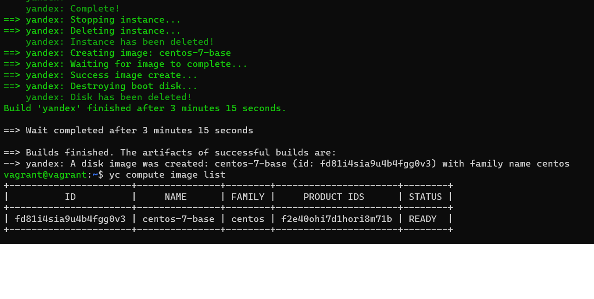

# 5.1. Введение в виртуализацию. Типы и функции гипервизоров. Обзор рынка вендоров и областей применения.
### 1. Опишите кратко, как вы поняли: в чем основное отличие полной (аппаратной) виртуализации, паравиртуализации и виртуализации на основе ОС.
Главное отличие полной виртуализации, паравиртуализации и виртуализации на основе ОС состоит в степени "модификации" гостевой операционной системы.
```TEXT
а. Полная виртуализация: гостевая ОС не подвергается изменению, остается в исходном состоянии.
б. Паравиртуализация: у гостевых ОС вносятся изменения в ядро.
в. Виртуализации на основе ОС: гостевые ОС используют ядро основной ОС сервера.
```
### 2. Выберите один из вариантов использования организации физических серверов, в зависимости от условий использования.
#### а. Высоконагруженная база данных, чувствительная к отказу.
```TEXT
Физические сервера:
Обеспечивается высокая производительность и минимальное время отклика, более высокая 
отказоустойчивость за счет исключения промежуточного звена - виртуализации.
Ресурсы сервера не разделяются между различными ВМ и оптимальным образом используются 
для главного приложения. 
```
#### б. Различные web-приложения.
```TEXT
Виртуализация уровня ОС:
Оптимальное использование ресурсов, быстрота масштабирования, сокращение издержек, 
связанных с администрированием и сопровождением.
```
#### в. Windows системы для использования бухгалтерским отделом.
```TEXT
Паравиртуализация:
Обеспечивается достаточная отказоустойчивость, при этом нет потребности в высокой 
производительности, т.е. нет необходимости эксклюзивного использования физических 
ресурсов.
```
#### г. Системы, выполняющие высокопроизводительные расчеты на GPU.
```TEXT
Физические сервера:
Обеспечивается высокая производительность за счет эксклюзивного использования аппаратных
ресурсов и исключения промежуточного слоя - виртуализации.
```
### 3. Выберите подходящую систему управления виртуализацией для предложенного сценария. Детально опишите ваш выбор.
```TEXT
1. 100 виртуальных машин на базе Linux и Windows, общие задачи, нет особых требований. 
Преимущественно Windows based инфраструктура, требуется реализация программных
балансировщиков нагрузки, репликации данных и автоматизированного механизма создания 
резервных копий.

Ответ: 
Hyper-V, также можно vSphere.  Удовлетворяют всем требованиям сценария. 
Поддерживают Windows и Linux. Содержат средства балансировки нагрузки, 
репликации данных и автоматизированного механизма создания резервных копий.
```
```TEXT
2. Требуется наиболее производительное бесплатное open source решение для виртуализации небольшой 
(20-30 серверов) инфраструктуры на базе Linux и Windows виртуальных машин.

Ответ:
KVM, Xen PV. Оpen source, поддерживают Linux и Windows.
```
```TEXT
3. Необходимо бесплатное, максимально совместимое и производительное решение для виртуализации 
Windows инфраструктуры.

Ответ:
Hyper-V Server. Максимально совместимый c Windows, бесплатный продукт.
```
```TEXT
4. Необходимо рабочее окружение для тестирования программного продукта на нескольких дистрибутивах Linux.

Ответ:
KVM. Является нативным для большинства ядер Linux, имеет хороршую производительность.
Каждая гостевая машина работает как процесс на хостовой машине, что хорошо для 
обнаружения источника проблемы при тестировании.
```
### 4. Опишите возможные проблемы и недостатки гетерогенной среды виртуализации (использования нескольких систем управления виртуализацией одновременно) и что необходимо сделать для минимизации этих рисков и проблем. Если бы у вас был выбор, то создавали бы вы гетерогенную среду или нет? Мотивируйте ваш ответ примерами.
```TEXT
Проблемы и недостатки гетерогенной среды виртуализации: необходимость поддержки 
разных систем, что требует увеличение затрат на оборудование, ПО и найм 
дорполнительных специалистов. 
Кроме того, более сложные и разноплановые системы снижают управляемость 
инфраструктурой, масштабируемость, а также уменьшают надежность и 
отказоустойчивость.
Поэтому лучше избегать использования гетерогенной среды. Если же нет возможности 
перейти на единообразную платформу, лучше использовать среды виртуализации
с более низким порогом входа. Также в этом случае будет полезно использовать 
программные системы мониторинга (Tivoli Monitoring, System Center и др.), 
чтобы минимизировать риски "зоопарка систем".
```

# 5.2. Применение принципов IaaC в работе с виртуальными машинами
### Задача 1
```TEXT
Опишите своими словами основные преимущества применения на практике IaaC паттернов.

Ответ:
Ускорение процесса создания инфраструктуры за счет автоматизации, стабильность
и предсказуемость инфраструктуры, уменьшение ошибок, более простая и эффективная 
поддержка и развитие сред, более быстрая разработка конечного продукта.
```
```TEXT
Какой из принципов IaaC является основополагающим?

Ответ:
Идемпотентность. Идентичность результата при повторных выполнениях, что 
обеспечивает предсказуемость конфигурации.
 ```
### Задача 2
```TEXT
Чем Ansible выгодно отличается от других систем управление конфигурациями?

Ответ:
Ansible более прост в использовании, использует существующую SSH инфраструктуру, 
в то время как другие инструменты требуют установки специального PKI-окружения,
расширяем (легкое подключение кастомных ролей и иодулей).
```
```TEXT
Какой, на ваш взгляд, метод работы систем конфигурации более надёжный push или pull?

Ответ:
Метод push обеспечивает большую надежность, т.к. при нем происходит централизованное
управление конфигурациями. Это дает возможность в любой момент времени
иметь актуальную информацию о конфигурациях, делает процесс управления конфигурациями
более прозрачным и предсказуемым.  
 ```
### Задача 3
```TEXT
Установить на личный компьютер:
  VirtualBox
  Vagrant
  Ansible
Приложить вывод команд установленных версий каждой из программ, оформленный в markdown.
```
Ответ:
```bash
~$ vboxmanage --version
6.1.28r147628
~$ vagrant --version
Vagrant 2.2.19
~$ ansible --version
ansible 2.9.27
  config file = /etc/ansible/ansible.cfg
  configured module search path = [u'/home/user/.ansible/plugins/modules', u'/usr/share/ansible/plugins/modules']
  ansible python module location = /usr/lib/python2.7/dist-packages/ansible
  executable location = /usr/bin/ansible
  python version = 2.7.17 (default, Feb 27 2021, 15:10:58) [GCC 7.5.0]
```

# 5.3. Введение. Экосистема. Архитектура. Жизненный цикл Docker контейнера
### Задача 1
Ссылка на ответ: https://hub.docker.com/r/vadimburyakov/netology-homework53-nginx 
### Задача 2
```TEXT
Сценарий 1
Высоконагруженное монолитное java веб-приложение.

Решение
Физический сервер. При высокой нагруженности затраты ресурсов на виртуализацию - не желательны. 
Монолитность затрудняет возможность реализации в микросервисах. 
С другой стороны, при возможности масштабирования можно использовать докер.
 ```
```TEXT
Сценарий 2
Nodejs веб-приложение.

Решение
Докер. Позволяет быстро разворачивать и масштабировать приложение.
 ```
```TEXT
Сценарий 3
Мобильное приложение c версиями для Android и iOS.

Решение
Возможно подойдет виртуальная машина, что позволит создать окружение для приложения.
 ```
```TEXT
Сценарий 4
Шина данных на базе Apache Kafka.

Решение
Докер. Дает возможность организации кластера с оркестратором и возможность быстрого отката.
 ```
```TEXT
Сценарий 5
Elasticsearch кластер для реализации логирования продуктивного веб-приложения - три ноды elasticsearch, 
два logstash и две ноды kibana.

Решение
Докер или виртуальная машина. Докер удобнее для кластеризации.
 ```
```TEXT
Сценарий 6
Мониторинг-стек на базе Prometheus и Grafana.

Решение
Докер. Невысокая загруженность, быстрое развертывание и масштабируемость под доп. задачи.
 ```
```TEXT
Сценарий 7
MongoDB, как основное хранилище данных для java-приложения.

Решение
Докер или физический сервер. С одной стороны даже есть официальный докер-образ. 
С другой стороны, при высокой нагрузке лучше использовать физический сервер. 
 ```
```TEXT
Сценарий 8
Gitlab сервер для реализации CI/CD процессов и приватный (закрытый) Docker Registry.

Решение
Виртуальная машина. Нет необходимости в масштабировании и постоянном обновлении. Возможна миграция.
 ```
### Задача 3
Запуск первого контейнера (из образа centos c любым тэгом) в фоновом режиме, с подключением папки /data из
текущей рабочей директории на хосте в /data контейнера.
```bash
~$ docker run -it -d --name centos -v ~/data:/data centos
2d9a24497620b4b2d89fa5ff2b59db97d175ac4589d46360a7e856df6485b381
```
Запуск второго контейнера (из образа debian с любым тегом) в фоновом режиме, с подключением папки /data из 
текущей рабочей директории на хосте в /data контейнера.
```bash
~$ docker run -it -d --name debian -v ~/data:/data debian
4c1ac1e24b8ceae6540772b0282bd6bf529a0c48c7d050cccaff687ced604d45
```
Подключение к первому контейнеру с помощью docker exec и создание текстового файла любого содержания в /data.
```bash
~$ docker exec -it centos bash
[root@2d9a24497620 /]# echo "hello frm centos" > /data/centos.txt
[root@2d9a24497620 /]# exit
exit
```
Добавление еще одного файл в папку /data на хостовой машине.
```bash
~$ echo "hello frm host" > ~/data/host.txt
```
Подключение во второй контейнер и отображение листинга и содержания файлов в /data контейнера.
```bash
~$ docker exec -it debian bash
root@4c1ac1e24b8c:/# ls -l /data
total 8
-rw-r--r-- 1 root root 17 Feb  5 11:44 centos.txt
-rw-rw-r-- 1 1000 1000 15 Feb  5 11:46 host.txt
root@4c1ac1e24b8c:/# cat /data/centos.txt
hello frm centos
root@4c1ac1e24b8c:/# cat /data/host.txt
hello frm host
root@4c1ac1e24b8c:/# exit
exit

```

# 5.4. Оркестрация группой Docker контейнеров на примере Docker Compose
### Задача 1
Образ операционной системы, созданный с помощью Packer.


### Задача 2
Скриншот страницы свойств созданной ВМ.

### Задача 3
Скриншот работающего веб-интерфейса Grafana с текущими метриками.


# 5.5. Оркестрация кластером Docker контейнеров на примере Docker Swarm
### Задача 1
Дайте письменные ответы на следующие вопросы:
```TEXT
В чём отличие режимов работы сервисов в Docker Swarm кластере: replication и global?

Ответ:
Режим replication: задается число запускаемых на кластере реплик сервиса. Распределение реплик между узлами 
осуществляется системой таким образом, что на одном узле может быть 0, 1 и более реплик. 
В случае режима global на каждом узле запускается ровно одна реплика сервиса. 
```
```TEXT
Какой алгоритм выбора лидера используется в Docker Swarm кластере?

Ответ:
Используется Raft алгоритм.
```
```TEXT
Что такое Overlay Network?

Ответ:
Overlay Network - это внутренняя сеть, которая охватывает все узлы, участвующие в swarm-кластере, соединяет
демоны Docker между собой и обеспечивает взаимодействие swarm служб.
```
### Задача 2
Создан Docker Swarm кластер в Яндекс.Облаке

Скриншот вывода команды `docker node ls`

### Задача 3
Создан готовый к боевой эксплуатации кластер мониторинга, состоящий из стека микросервисов.

Скриншот вывода команды `docker service ls`


# 6.1. Типы и структура СУБД
### Задача 1
Выберите подходящие типы СУБД для каждой сущности и объясните свой выбор.
```TEXT
Электронные чеки в json виде.

Ответ:
Документо-ориентированная. Стандартный способ хранения документов json. 
```
```TEXT
Склады и автомобильные дороги для логистической компании.

Ответ:
Графовая. Склады и дороги математически представляют собой граф (вершины и ребра).
```
```TEXT
Генеалогические деревья.

Ответ:
Иерархическая. Генеалогические деревья имеют иерархическую структуру.
```
```TEXT
Кэш идентификаторов клиентов с ограниченным временем жизни для движка аутентификации.

Ответ:
Ключ-значение. Классический подход для данного примера.
```
```TEXT
Отношения клиент-покупка для интернет-магазина.

Ответ:
Реляционная БД. Такие БД специально создавались для работы с отношениями.
```
### Задача 2
Классификация реализаций согласно CAP, PACELC.
```TEXT
1. Если предполагается, что система всегда доступна, но узлы могут ответить не одинаково
(данные не согласованы), т.к. долго не синхронизируются (устойчивы к разделению), то по CAP: AP.
По PACELC - (PA/EL), т.к., действительно, ближе Latency. 
2. Если система все-таки отвечает, хотя и не корректно (или даже сбрасывает соединение),
избегая дать несогласованные данные, то по CAP - СА, по PACELC - (PC/EC), т.к. 
приоритет - согласованность. 
3. Система может не прислать корректный ответ или сбросить соединение: по CAP: CP, по PACELC - (PC/EC)
```
### Задача 3
Могут ли в одной системе сочетаться принципы BASE и ACID? Почему?
```TEXT
Нет. Эти принципы противоречат друг другу. По ACID данные согласованы, а по BASE нет. 
```
### Задача 4
Ответ:
```TEXT
Redis - key-value хранилище, имеющее механизм Pub/Sub. В данном случае установка ключей с ttl +
подписка на нотификацию о просроченных ключах.
Минусы: Ограничение хранилища - все данные должны поместиться в оперативной памяти. Redis предлагает
только базовую безопасность, нет механизма ролей. Отсутствует язык запросов (типа SQL) - теряется гибкость. 
```

# 6.2. SQL
### Задача 1
docker-compose манифест:
```yaml
version: "3.1"
services:
  postgres:
    image: postgres:12
    environment:
      POSTGRES_DB: "netology"
      POSTGRES_USER: "netology"
      POSTGRES_PASSWORD: "net_123"
      PGDATA: "/var/lib/postgresql/data/pgdata"
    container_name: netology_psql
    volumes:
      - ./backup:/backup
      - .:/var/lib/postgresql/data
    ports:
      - "5432:5432"
    restart: always
```
Запускаем и заходим в БД
```bash
docker-compose up -d
docker exec -it netology_psql psql -U netology -W netology
```
### Задача 2
Cоздайте пользователя test-admin-user и БД test_db.
```
CREATE DATABASE test_db;
CREATE USER "test-admin-user" WITH PASSWORD 'net_123';
```
В БД test_db создайте таблицу orders и clients.
```
CREATE TABLE orders (id SERIAL PRIMARY KEY, name VARCHAR(255), price INT);
CREATE TABLE clients (id SERIAL PRIMARY KEY, last_name VARCHAR(30), country VARCHAR(30), 
                      order_id INT, FOREIGN KEY (order_id) REFERENCES orders (id));
CREATE INDEX index_country ON clients (country);
```
Предоставьте привилегии на все операции пользователю test-admin-user на таблицы БД test_db.
```
GRANT CONNECT ON DATABASE test_db to "test-admin-user";
GRANT ALL ON ALL TABLES IN SCHEMA public to "test-admin-user";
```
Создайте пользователя test-simple-user.
```
CREATE USER "test-simple-user";
```
Предоставьте пользователю test-simple-user права на SELECT/INSERT/UPDATE/DELETE данных таблиц БД test_db.
```
GRANT CONNECT ON DATABASE test_db to "test-simple-user";
GRANT SELECT, INSERT, UPDATE, DELETE ON ALL TABLES IN SCHEMA public to "test-simple-user";
```
Итоговый список БД после выполнения пунктов выше:
```
netology=# \l
                                     List of databases
   Name    |  Owner   | Encoding |  Collate   |   Ctype    |       Access privileges
-----------+----------+----------+------------+------------+-------------------------------
 netology  | netology | UTF8     | en_US.utf8 | en_US.utf8 |
 postgres  | netology | UTF8     | en_US.utf8 | en_US.utf8 |
 template0 | netology | UTF8     | en_US.utf8 | en_US.utf8 | =c/netology                  +
           |          |          |            |            | netology=CTc/netology
 template1 | netology | UTF8     | en_US.utf8 | en_US.utf8 | =c/netology                  +
           |          |          |            |            | netology=CTc/netology
 test_db   | netology | UTF8     | en_US.utf8 | en_US.utf8 | =Tc/netology                 +
           |          |          |            |            | netology=CTc/netology        +
           |          |          |            |            | "test-admin-user"=c/netology +
           |          |          |            |            | "test-simple-user"=c/netology
(5 rows)
```
Описание таблиц (describe):
```
netology-# \d orders
                                    Table "public.orders"
 Column |          Type          | Collation | Nullable |              Default
--------+------------------------+-----------+----------+------------------------------------
 id     | integer                |           | not null | nextval('orders_id_seq'::regclass)
 name   | character varying(255) |           |          |
 price  | integer                |           |          |
Indexes:
    "orders_pkey" PRIMARY KEY, btree (id)
Referenced by:
    TABLE "clients" CONSTRAINT "clients_order_id_fkey" FOREIGN KEY (order_id) REFERENCES orders(id)
```
```
netology-# \d clients
                                     Table "public.clients"
  Column   |         Type          | Collation | Nullable |               Default
-----------+-----------------------+-----------+----------+-------------------------------------
 id        | integer               |           | not null | nextval('clients_id_seq'::regclass)
 last_name | character varying(30) |           |          |
 country   | character varying(30) |           |          |
 order_id  | integer               |           |          |
Indexes:
    "clients_pkey" PRIMARY KEY, btree (id)
    "index_country" btree (country)
Foreign-key constraints:
    "clients_order_id_fkey" FOREIGN KEY (order_id) REFERENCES orders(id)
```
SQL-запрос для выдачи списка пользователей с правами над таблицами test_db:
```
SELECT grantee, table_name, privilege_type FROM information_schema.table_privileges 
WHERE grantee LIKE 'te%';
```
Список пользователей с правами над таблицами test_db:
```
netology=# SELECT grantee, table_name, privilege_type FROM information_schema.table_privileges
WHERE grantee LIKE 'te%';
     grantee      | table_name | privilege_type
------------------+------------+----------------
 test-admin-user  | orders     | INSERT
 test-admin-user  | orders     | SELECT
 test-admin-user  | orders     | UPDATE
 test-admin-user  | orders     | DELETE
 test-admin-user  | orders     | TRUNCATE
 test-admin-user  | orders     | REFERENCES
 test-admin-user  | orders     | TRIGGER
 test-admin-user  | clients    | INSERT
 test-admin-user  | clients    | SELECT
 test-admin-user  | clients    | UPDATE
 test-admin-user  | clients    | DELETE
 test-admin-user  | clients    | TRUNCATE
 test-admin-user  | clients    | REFERENCES
 test-admin-user  | clients    | TRIGGER
 test-simple-user | orders     | INSERT
 test-simple-user | orders     | SELECT
 test-simple-user | orders     | UPDATE
 test-simple-user | orders     | DELETE
 test-simple-user | clients    | INSERT
 test-simple-user | clients    | SELECT
 test-simple-user | clients    | UPDATE
 test-simple-user | clients    | DELETE
(22 rows)
```
### Задача 3
Используя SQL синтаксис - наполните таблицы следующими тестовыми данными:
```
INSERT INTO orders (name, price) VALUES ('Шоколад', 10), ('Принтер', 3000), 
('Книга', 500), ('Монитор', 7000), ('Гитара', 4000);
```
```
netology=# select * FROM orders;
 id |  name   | price
----+---------+-------
  1 | Шоколад |    10
  2 | Принтер |  3000
  3 | Книга   |   500
  4 | Монитор |  7000
  5 | Гитара  |  4000
(5 rows)
```
```
INSERT INTO clients (last_name, country) VALUES ('Иванов Иван Иванович', 'USA'), 
('Петров Петр Петрович', 'Canada'), ('Иоганн Себастьян Бах', 'Japan'), 
('Ронни Джеймс Дио', 'Russia'), ('Ritchie Blackmore', 'Russia');
```
```
netology=# select * from clients;
 id |      last_name       | country | order_id
----+----------------------+---------+----------
  1 | Иванов Иван Иванович | USA     |
  2 | Петров Петр Петрович | Canada  |
  3 | Иоганн Себастьян Бах | Japan   |
  4 | Ронни Джеймс Дио     | Russia  |
  5 | Ritchie Blackmore    | Russia  |
(5 rows)
```
Вычислите количество записей для каждой таблицы:
```
netology=# select count(*) from orders;
 count
-------
     5
(1 row)

netology=# select count(*) from clients;
 count
-------
     5
(1 row)
```
### Задача 4

Часть пользователей из таблицы clients решили оформить заказы из таблицы orders.
Используя foreign keys свяжите записи из таблиц, согласно таблице.

Приведите SQL-запросы для выполнения данных операций.
```
UPDATE clients SET order_id = (SELECT id FROM orders WHERE name = 'Книга') 
WHERE last_name = 'Иванов Иван Иванович';
UPDATE clients SET order_id = (SELECT id FROM orders WHERE name = 'Монитор') 
WHERE last_name = 'Петров Петр Петрович';
UPDATE clients SET order_id = (SELECT id FROM orders WHERE name = 'Гитара') 
WHERE last_name = 'Иоганн Себастьян Бах';
```
Приведите SQL-запрос для выдачи всех пользователей, которые совершили заказ, а также вывод данного запроса.
```
netology=# SELECT clients.id, clients.last_name, orders.name FROM clients INNER JOIN orders ON orders.id = clients.order_id;
 id |      last_name       |  name
----+----------------------+---------
  1 | Иванов Иван Иванович | Книга
  2 | Петров Петр Петрович | Монитор
  3 | Иоганн Себастьян Бах | Гитара
(3 rows)
```
### Задача 5
Получение полной информации по выполнению запроса выдачи всех пользователей из задачи 4.
```
netology=# EXPLAIN SELECT clients.id, clients.last_name, orders.name FROM clients INNER JOIN orders ON orders.id = clients.order_id;
                              QUERY PLAN
-----------------------------------------------------------------------
 Hash Join  (cost=13.15..28.47 rows=420 width=598)
   Hash Cond: (clients.order_id = orders.id)
   ->  Seq Scan on clients  (cost=0.00..14.20 rows=420 width=86)
   ->  Hash  (cost=11.40..11.40 rows=140 width=520)
         ->  Seq Scan on orders  (cost=0.00..11.40 rows=140 width=520)
(5 rows)
```

Команда выводит план выполнения, генерируемый планировщиком.
По каждой операции приведена стоимость запуска и общая стоимость выполнения, ожидаемое 
количсество строк и средняя длина строки в байтах. 
Cтроки первой таблицы записываются в хеш-таблицу в памяти, после чего сканируется вторая таблица
и для каждой её строки проверяется соответствие по хеш-таблице

### Задача 6
Приведите список операций, который вы применяли для бэкапа данных и восстановления.
```
pg_dump -U netology -W test_db > /backup/test_db.bkp
psql -U netology -W test_db < /backup/test_db.bkp
```

# 6.3. MySQL
### Задача 1
Используя docker поднимите инстанс MySQL (версию 8). Данные БД сохраните в volume.
```bash
$ docker run --name mysql-netology -v /home/user/netology/6.3/data:/var/lib/mysql \
-e MYSQL_ROOT_PASSWORD=net_123 -p 3306:3306 -d mysql:8
```
Изучите бэкап БД и восстановитесь из него.
```bash
$ docker exec -i mysql-netology sh -c 'exec mysql -uroot -pnet_123 test_db' < ./test_dump.sql
```
Перейдите в управляющую консоль mysql внутри контейнера.
```bash
$ docker exec -it mysql-netology mysql -u root -p
```
Найдите команду для выдачи статуса БД и приведите в ответе из ее вывода версию сервера БД.
```bash
mysql> \s
--------------
mysql  Ver 8.0.28 for Linux on x86_64 (MySQL Community Server - GPL)
...
```
Подключитесь к восстановленной БД и получите список таблиц из этой БД.
```bash
mysql> use test_db
...
Database changed
mysql> show tables;
+-------------------+
| Tables_in_test_db |
+-------------------+
| orders            |
+-------------------+
1 row in set (0.00 sec)
```
Приведите в ответе количество записей с price > 300.
```bash
mysql> select count(*) from orders where price > 300;
+----------+
| count(*) |
+----------+
|        1 |
+----------+
1 row in set (0.01 sec)
```
### Задача 2
Создайте пользователя test в БД c паролем test-pass.
```TEXT
mysql> CREATE USER 'test'@'localhost' 
       IDENTIFIED WITH mysql_native_password BY 'test-pass'
       WITH MAX_QUERIES_PER_HOUR 100
       PASSWORD EXPIRE INTERVAL 180 DAY
       FAILED_LOGIN_ATTEMPTS 3 PASSWORD_LOCK_TIME 2
       ATTRIBUTE '{"fname":"James", "lname":"Pretty"}';
Query OK, 0 rows affected (0.20 sec)
```
Предоставьте привилегии пользователю test на операции SELECT базы test_db.
```TEXT
mysql> grant select on test_db.* to 'test'@'localhost';
Query OK, 0 rows affected, 1 warning (0.02 sec)
```
Используя таблицу INFORMATION_SCHEMA.USER_ATTRIBUTES получите данные по пользователю test
и приведите в ответе к задаче.
```TEXT
mysql> select * from INFORMATION_SCHEMA.USER_ATTRIBUTES where user='test';
+------+-----------+---------------------------------------+
| USER | HOST      | ATTRIBUTE                             |
+------+-----------+---------------------------------------+
| test | localhost | {"fname": "James", "lname": "Pretty"} |
+------+-----------+---------------------------------------+
1 row in set (0.00 sec)
```
### Задача 3
Установите профилирование SET profiling = 1
```TEXT
mysql> SET profiling = 1;
Query OK, 0 rows affected, 1 warning (0.00 sec)
```
Исследуйте, какой engine используется в таблице БД test_db и приведите в ответе.
```TEXT
mysql> select table_schema, table_name, engine from information_schema.tables where table_schema="test_db";
+--------------+------------+--------+
| TABLE_SCHEMA | TABLE_NAME | ENGINE |
+--------------+------------+--------+
| test_db      | orders     | InnoDB |
+--------------+------------+--------+
1 row in set (0.00 sec)

Используется engine InnoDB
```
Измените engine и приведите время выполнения и запрос на изменения из профайлера в ответе.
```TEXT
mysql> alter table orders ENGINE = MyISAM;
Query OK, 5 rows affected (0.20 sec)
Records: 5  Duplicates: 0  Warnings: 0

mysql> alter table orders ENGINE = InnoDB;
Query OK, 5 rows affected (0.15 sec)
Records: 5  Duplicates: 0  Warnings: 0

mysql> SHOW PROFILES;
+----------+------------+-----------------------------------------------------------------------------------------------------+
| Query_ID | Duration   | Query                                                                                               |
+----------+------------+-----------------------------------------------------------------------------------------------------+
|        1 | 0.00488100 | select table_schema, table_name, engine from information_schema.tables where table_schema="test_db" |
|        2 | 0.19980100 | alter table orders ENGINE = MyISAM                                                                  |
|        3 | 0.15610200 | alter table orders ENGINE = InnoDB                                                                  |
+----------+------------+-----------------------------------------------------------------------------------------------------+
3 rows in set, 1 warning (0.00 sec)
```
### Задача 4
Изучите файл my.cnf в директории /etc/mysql. Измените его согласно ТЗ (движок InnoDB).
```TEXT
[mysqld]
pid-file        = /var/run/mysqld/mysqld.pid
socket          = /var/run/mysqld/mysqld.sock
datadir         = /var/lib/mysql
secure-file-priv= NULL

# Custom config should go here
!includedir /etc/mysql/conf.d/

innodb_flush_log_at_trx_commit = 2
innodb_file_per_table = ON
innodb_log_buffer_size = 1M
# 30% RAM
innodb_buffer_pool_size = 300M
innodb_log_file_size = 100M
```

# 6.4. PostgreSQL
### Задача 1
Используя docker поднимите инстанс PostgreSQL (версию 13).
```yaml
version: "3.1"
services:
  postgres:
    image: postgres:13
    environment:
      POSTGRES_PASSWORD: "net_123"
      PGDATA: "/var/lib/postgresql/data/pgdata"
    container_name: netology_psql
    volumes:
      - ./backup:/backup
      - .:/var/lib/postgresql/data
    ports:
      - "5432:5432"
    restart: always
```
```bash
docker-compose up -d
Creating network "64_default" with the default driver
Creating netology_psql ... done
```
Подключитесь к БД PostgreSQL используя psql.
```bash
docker exec -it netology_psql psql -U postgres -W
psql (13.6 (Debian 13.6-1.pgdg110+1))
```
Воспользуйтесь командой \? для вывода подсказки по имеющимся в psql управляющим командам.
Найдите и приведите управляющие команды для:
```TEXT
- вывода списка БД: \l
- подключения к БД: \c
- вывода списка таблиц: \d 
- вывода описания содержимого таблиц: \d 'table name'
- выхода из psql: \q
```
### Задача 2
Используя psql создайте БД test_database.
```TEXT
postgres=# create database test_database;
CREATE DATABASE
```
Восстановите бэкап БД в test_database.
```TEXT
docker exec -it netology_psql psql -U postgres -d test_database -f backup/test_dump.sql
```
Подключитесь к восстановленной БД и проведите операцию ANALYZE для сбора статистики по таблице.
```TEXT
postgres=# \c test_database
test_database=# analyze orders;
ANALYZE
```
Используя таблицу pg_stats, найдите столбец таблицы orders с наибольшим средним значением размера элементов в байтах.
```TEXT
test_database=# select attname, avg_width from pg_stats where tablename = 'orders' order by avg_width desc limit 1;
 attname | avg_width
---------+-----------
 title   |        16
(1 row)
```
### Задача 3
Вам предложили провести разбиение таблицы на 2 (шардировать на orders_1 - price>499 и orders_2 - price<=499).
Предложите SQL-транзакцию для проведения данной операции.
```TEXT
 BEGIN;
 CREATE TABLE orders_1 (CONSTRAINT price CHECK (price > 499)) INHERITS (orders);
 CREATE TABLE orders_2 (CONSTRAINT price CHECK (price <= 499)) INHERITS (orders);
 INSERT INTO orders_1 SELECT * FROM orders where price > 499;
 INSERT INTO orders_2 SELECT * FROM orders where price <= 499;
 COMMIT;
```
Можно ли было изначально исключить "ручное" разбиение при проектировании таблицы orders?
```TEXT
Да. Для этого нужно было при создании сделать таблицу секционированной:
CREATE TABLE orders (     
    id integer NOT NULL,
    title character varying(80) NOT NULL,
    price integer DEFAULT 0
    ) PARTITION BY RANGE (price);
CREATE TABLE orders_1 PARTITION OF orders FOR VALUES FROM (500) TO (MAXVALUE);
CREATE TABLE orders_2 PARTITION OF orders FOR VALUES FROM (MINVALUE) TO (500);
```
### Задача 4
Используя утилиту pg_dump создайте бекап БД test_database.
```TEXT
docker exec -it netology_psql bash
root@c3a41ce95a0a:/# cd backup
root@c3a41ce95a0a:/backup# pg_dump -U postgres -d test_database > test_dump_2.sql
```
Как бы вы доработали бэкап-файл, чтобы добавить уникальность значения столбца title для таблиц test_database?
```TEXT
ALTER TABLE orders ADD UNIQUE (title);
ALTER TABLE orders_1 ADD UNIQUE (title);
ALTER TABLE orders_2 ADD UNIQUE (title);
```

# 6.5. Elasticsearch
### Задача 1
Текст Dockerfile манифеста.
```TEXT
FROM centos:7

ENV ES_DISTR="/opt/elasticsearch"
ENV ES_HOME="${ES_DISTR}/elasticsearch-7.17.1"
ENV ES_DATA_DIR="/var/lib/data"
ENV ES_LOG_DIR="/var/lib/logs"
ENV ES_BACKUP="/opt/elasticsearch/snapshots"
ENV ES_JAVA_OPTS="-Xms512m -Xmx512m"

WORKDIR "${ES_DISTR}"

RUN yum install wget -y

RUN yum install perl-Digest-SHA -y

RUN wget https://artifacts.elastic.co/downloads/elasticsearch/elasticsearch-7.17.1-linux-x86_64.tar.gz && \
    wget https://artifacts.elastic.co/downloads/elasticsearch/elasticsearch-7.17.1-linux-x86_64.tar.gz.sha512 && \
    shasum -a 512 -c elasticsearch-7.17.1-linux-x86_64.tar.gz.sha512 && \
    tar -xzf elasticsearch-7.17.1-linux-x86_64.tar.gz

COPY elasticsearch.yml ${ES_HOME}/config

ENV ES_USER="elasticsearch"

RUN useradd ${ES_USER}

RUN mkdir -p "${ES_DATA_DIR}" && \
    mkdir -p "${ES_LOG_DIR}" && \
    mkdir -p "${ES_BACKUP}" && \
    chown -R ${ES_USER}: "${ES_DISTR}" && \
    chown -R ${ES_USER}: "${ES_DATA_DIR}" && \
    chown -R ${ES_USER}: "${ES_BACKUP}" && \
    chown -R ${ES_USER}: "${ES_LOG_DIR}"

USER ${ES_USER}

WORKDIR "${ES_HOME}"

EXPOSE 9200
EXPOSE 9300

ENTRYPOINT ["./bin/elasticsearch"]
```
Конфигурационый файл elasticsearch
```TEXT
discovery.type: single-node

cluster.name: net_elasticsearch

node.name: netology_test

path.data: /var/lib/data

path.logs: /var/lib/logs

path.repo: /opt/elasticsearch/snapshots

network.host: 0.0.0.0
```
Cсылка на образ в репозитории dockerhub: https://hub.docker.com/r/vadimburyakov/net_elasticsearch

Ответ elasticsearch на запрос пути / в json виде.
```TEXT
$ curl localhost:9200/
{
  "name" : "netology_test",
  "cluster_name" : "net_elasticsearch",
  "cluster_uuid" : "RTdc4HD8SJSFErtsGqs-8A",
  "version" : {
    "number" : "1.0.1",
    "build_flavor" : "default",
    "build_type" : "tar",
    "build_hash" : "e5acb99f744433d62d6333ce45a4543dc1c8059a",
    "build_date" : "2022-03-30T18:17:42.253567231Z",
    "build_snapshot" : false,
    "lucene_version" : "8.11.1",
    "minimum_wire_compatibility_version" : "6.8.0",
    "minimum_index_compatibility_version" : "6.0.0-beta1"
  },
  "tagline" : "You Know, for Search"
}
```
### Задача 2
```TEXT
curl -X PUT "localhost:9200/ind-1?pretty" -H 'Content-Type: application/json' -d'
{
  "settings": {
    "number_of_shards": 1,
    "number_of_replicas": 0
  }
}
'
...
```
Получите список индексов и их статусов, используя API и приведите в ответе на задание.
```TEXT
$ curl -X GET 'http://localhost:9200/_cat/indices?v'
health status index            uuid                   pri rep docs.count docs.deleted store.size pri.store.size
green  open   .geoip_databases YT9KrFzSQTWhr6ctc9Vuvq   1   0         41            0     39.5mb         39.5mb
green  open   ind-1            SpGtiPgiSE-Bz25loNfCmw   1   0          0            0       226b           226b
yellow open   ind-3            UbZphIL9T6qnRtcWegVBlQ   4   2          0            0       904b           904b
yellow open   ind-2            z2RtvQJdQ9CNVmtmn6D2uQ   2   1          0            0       452b           452b
```
Получите состояние кластера elasticsearch, используя API.
```TEXT
curl -XGET localhost:9200/_cluster/health/?pretty=true
{
  "cluster_name" : "netology_elasticsearch",
  "status" : "yellow",
  "timed_out" : false,
  "number_of_nodes" : 1,
  "number_of_data_nodes" : 1,
  "active_primary_shards" : 10,
  "active_shards" : 10,
  "relocating_shards" : 0,
  "initializing_shards" : 0,
  "unassigned_shards" : 10,
  "delayed_unassigned_shards" : 0,
  "number_of_pending_tasks" : 0,
  "number_of_in_flight_fetch" : 0,
  "task_max_waiting_in_queue_millis" : 0,
  "active_shards_percent_as_number" : 50.0
}
```
Как вы думаете, почему часть индексов и кластер находится в состоянии yellow?
```TEXT
Два индекса имеют состояние yellow, так как у них есть реплики, а учитывая, что в кластере
всего одна нода - эти реплики некуда размещать.
```
```TEXT
curl -X DELETE 'http://localhost:9200/ind-1?pretty'
...
```

### Задача 3
Приведите в ответе запрос API и результат вызова API для создания репозитория.
```TEXT
$ curl -X PUT "localhost:9200/_snapshot/netology_backup?pretty" -H 'Content-Type: application/json' -d'
> {
>   "type": "fs",
>   "settings": {
>     "location": "/opt/elasticsearch/snapshots"
>   }
> }
> '
{
  "acknowledged" : true
}
```
Создайте индекс test с 0 реплик и 1 шардом и приведите в ответе список индексов.
```TEXT
$ curl -X PUT "localhost:9200/test?pretty" -H 'Content-Type: application/json' -d'
> {
>   "settings": {
>     "number_of_shards": 1,
>     "number_of_replicas": 0
>   }
> }
> '
{
  "acknowledged" : true,
  "shards_acknowledged" : true,
  "index" : "test"
}
$ curl -X GET 'http://localhost:9200/_cat/indices?v'
health status index            uuid                   pri rep docs.count docs.deleted store.size pri.store.size
green  open   .geoip_databases q1rfDFs1RJOET0PNOVh6NQ   1   0         41            0     39.5mb         39.5mb
green  open   test             NirLU5ZTS9m64LHU0ala8g   1   0          0            0       226b           226b
```
Создайте snapshot состояния кластера elasticsearch.
```TEXT
curl -X PUT "localhost:9200/_snapshot/netology_backup/my_snapshot?wait_for_completion=true&pretty"
```
Приведите в ответе список файлов в директории со snapshotами.
```TEXT
$docker exec netology_elasticsearch ls -l /opt/elasticsearch/snapshots
total 48
-rw-r--r-- 1 elasticsearch elasticsearch  1423 Mar 30 19:15 index-0
-rw-r--r-- 1 elasticsearch elasticsearch     8 Mar 30 19:15 index.latest
drwxr-xr-x 6 elasticsearch elasticsearch  4096 Mar 30 19:15 indices
-rw-r--r-- 1 elasticsearch elasticsearch 29277 Mar 30 19:15 meta-E6Fo2m1yRzOM_iTatPJgPA.dat
-rw-r--r-- 1 elasticsearch elasticsearch   710 Mar 30 19:15 snap-E6Fo2m1yRzOM_iTatPJgPA.dat
```
Удалите индекс test и создайте индекс test-2. Приведите в ответе список индексов.
```TEXT
$curl -X DELETE 'http://localhost:9200/test?pretty'
{
  "acknowledged" : true
}
$ curl -X PUT "localhost:9200/test-2?pretty" -H 'Content-Type: application/json' -d'
$ curl -X GET 'http://localhost:9200/_cat/indices?v'
health status index            uuid                   pri rep docs.count docs.deleted store.size pri.store.size
green  open   .geoip_databases q1rfDFs1RJOET0PNOVh6NQ   1   0         41            0     39.5mb         39.5mb
green  open   test-2           NirLU5ZTS9m64LHU0ala8g   1   0          0            0       226b           226b
```
Приведите в ответе запрос к API восстановления и итоговый список индексов.
```TEXT
$ curl -X POST localhost:9200/_snapshot/netology_backup/my_snapshot/_restore?pretty -H 'Content-Type: application/json' -d'                              
> {
>   "indices": "test",
>   "include_global_state":true
> }
> '
{
  "accepted" : true
}
$ curl -X GET 'http://localhost:9200/_cat/indices?v'
health status index            uuid                   pri rep docs.count docs.deleted store.size pri.store.size
green  open   .geoip_databases 7YcC_R1UQTatrVoRc9K6lA   1   0         41            0     39.5mb         39.5mb
green  open   test-2           6qSRrJBSwq_nmcHSIxzMuw   1   0          0            0       226b           226b
green  open   test             q2BunjXoQJSVmvKoZLlNTw   1   0          0            0       226b           226b
```
